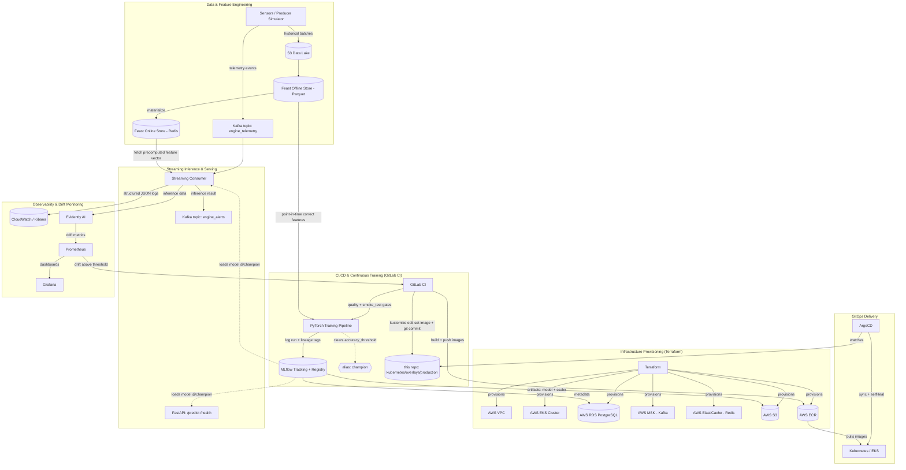

# Predictive Maintenance MLOps

**End-to-end MLOps platform for real-time Remaining Useful Life (RUL) classification on turbofan engines**

*Read this in other languages: [Español](README_es.md)*

[](LICENSE)
[](api/pyproject.toml)
[](core_ml/src/train.py)
[](core_ml/src/train.py)
[](docker-compose.yml)
[](kubernetes/base)
[](terraform)
[](.gitlab-ci.yml)
[](https://github.com/psf/black)

---

## Table of Contents

1. [Executive Summary](#executive-summary)
2. [System Architecture](#system-architecture)
3. [Technology Stack](#technology-stack)
4. [The MLOps Pipeline](#the-mlops-pipeline)
5. [Monitoring & Observability](#monitoring--observability)
6. [Architectural Decisions & Trade-offs](#architectural-decisions--trade-offs)
7. [API Reference](#api-reference)
8. [Repository Structure](#repository-structure)
9. [Getting Started](#getting-started)
10. [Quality & Security Gates](#quality--security-gates)
11. [Possible Extensions](#possible-extensions)
12. [License](#license)

---

## Summary

**The problem.** In industrial environments, unplanned equipment failure causes severe operational downtime, safety risk, and unplanned maintenance cost. Predicting *when* a machine is about to fail is a well-studied modeling problem; the much harder, and much more valuable, problem is operationalizing that prediction — processing high-throughput sensor telemetry continuously, guaranteeing that the exact same feature transformations are applied at training time and at inference time, and allowing the system to detect its own degradation and retrain itself without manual intervention.

**The solution.** This project implements a production-grade MLOps platform that predicts turbofan engine degradation (NASA C-MAPSS dataset) in real time. Remaining Useful Life (RUL) estimation is framed as a three-class classification problem — **Healthy**, **Alert**, **Critical** — served by a Fully Convolutional Network (FCN) trained in PyTorch. Around that model sits the part that actually makes it operable in production: a Feature Store that eliminates training/serving skew, a Model Registry that gates every deployment behind a measurable accuracy threshold, a streaming pipeline that turns raw Kafka messages into predictions with bounded retries and a circuit breaker, and a GitOps delivery path where the cluster can never silently drift from what was reviewed and merged.

**The value.** Every architectural decision in this repository optimizes for the same outcome: **failures caught locally, cheaply, and early — before they reach a customer, a GPU bill, or a production cluster.** Concretely: a data-contract violation is rejected before a training run ever starts, rather than surfacing as a corrupted model three stages later; a pipeline-breaking bug is caught in seconds against a fixed toy dataset instead of after a multi-hour run against the full dataset; a bad Kubernetes manifest is a `kustomize edit` that either applies cleanly or fails loudly, never a `sed` that silently no-ops; a manual `kubectl apply` against a live cluster is structurally impossible, because the pipeline itself no longer holds cluster credentials — only ArgoCD does, and it continuously reconciles the cluster to match Git. The result is a system where a new engineer can trust that "it passed CI" actually means something, and where a model only ever reaches the customers relying on it if it has proven itself against an explicit, auditable quality bar.

---

## System Architecture

The architecture is event-driven, cloud-native, and deliberately decouples every stage of the ML lifecycle so that each one can fail, scale, and be tested independently.



### Data Flow, in Words

1. **Ingestion.** Sensor telemetry arrives either as a continuous stream (Kafka topic `engine_telemetry`) or as historical batches landed in the S3 data lake.
2. **Feature engineering.** Historical data is transformed into fixed-size sliding windows (30 timesteps x 14 sensors) and written to the **Feast Offline Store** (S3/Parquet), which guarantees point-in-time correctness — no future data ever leaks into a training window. Those same feature definitions are materialized into the **Feast Online Store** (Redis) for low-latency lookups at inference time. Training and serving read from the same feature definitions, by construction: training/serving skew is not something this system has to be careful about, it is something the architecture makes structurally impossible.
3. **Training.** GitLab CI pulls point-in-time-correct historical features from the Feast offline store, trains the FCN in PyTorch, and logs the run to MLflow — model weights, the fitted `StandardScaler`, hyperparameters, and a full reproducibility tuple (Git commit SHA, DVC data hash, MLflow run ID, container image tag).
4. **Quality gate.** A trained model is evaluated on a held-out validation split. Only if it clears `monitoring.accuracy_threshold` (`config/config.yaml`) is its MLflow model version promoted to the `champion` alias. Anything that doesn't clear the bar stays registered, for audit, but is never served.
5. **Delivery.** GitLab CI builds and pushes container images to ECR, then updates the image tag declared in `kubernetes/overlays/production` and commits that change to Git. It never touches the cluster directly.
6. **Reconciliation.** ArgoCD, running inside the cluster, watches that path in Git and continuously reconciles the live cluster state to match it (`selfHeal: true`) — any out-of-band `kubectl edit` is automatically reverted.
7. **Inference.** The streaming consumer picks up a telemetry event, fetches the corresponding precomputed feature vector from the Feast online store (Redis), runs inference with the `champion`-aliased model, and publishes the classification (`Healthy` / `Alert` / `Critical`) to the `engine_alerts` Kafka topic. The FastAPI service exposes the same `champion` model synchronously over `/predict`, for on-demand scoring.
8. **Observability.** Every inference the consumer serves is logged as structured JSON and evaluated by Evidently AI against a reference distribution. Prometheus scrapes the resulting drift metrics; Grafana visualizes them; and if drift crosses a configured threshold, an automated trigger fires the retraining pipeline in GitLab CI — closing the loop without a human needing to notice the model has gone stale.

---

## Technology Stack

| Category | Tools | Purpose in this project |
| --- | --- | --- |
| **Machine Learning** | PyTorch, Fully Convolutional Network (FCN) | Multiclass RUL classification (Healthy / Alert / Critical) from sensor windows |
| **Tracking & Model Registry** | MLflow | Experiment tracking, artifact storage, and the *only* source of truth for which model version is servable (`champion` alias) |
| **Feature Store** | Feast, Redis, Apache Parquet | Point-in-time-correct offline training features + low-latency online feature serving, eliminating training/serving skew |
| **Data Versioning & Contracts** | DVC (S3 remote), Pandera, Pydantic | Reproducible dataset versioning; fail-fast schema validation at every pipeline stage |
| **Data Streaming** | Apache Kafka (Amazon MSK in production) | Decoupled, durable transport for telemetry ingestion and alert publishing |
| **API Serving** | FastAPI, Uvicorn | Synchronous, self-documenting, type-validated inference endpoint |
| **Containerization & Orchestration** | Docker, Docker Compose, Kubernetes (Amazon EKS), Kustomize | Local parity with production; declarative, environment-layered manifests |
| **GitOps & Delivery** | ArgoCD, External Secrets Operator | Pull-based, self-healing cluster reconciliation; secrets synced from AWS Secrets Manager, never committed |
| **Infrastructure as Code** | Terraform | Declarative, reproducible provisioning of the entire AWS footprint |
| **Cloud Infrastructure** | AWS VPC, EKS, RDS (PostgreSQL), MSK, ElastiCache (Redis), S3, ECR, Secrets Manager, IAM (OIDC federation, IRSA) | Managed, private-by-default infrastructure with no long-lived static credentials |
| **Local Integration Testing** | Testcontainers, LocalStack | Real, ephemeral Postgres/Kafka/S3/SQS/Secrets Manager containers proving actual integration, at zero cloud cost |
| **Monitoring & Observability** | Evidently AI, Prometheus, Grafana, structlog, tenacity, pybreaker | Data/concept drift detection, metrics, JSON-structured logs, bounded retries, circuit breaking |
| **CI/CD** | GitLab CI/CD, AWS OIDC, gitlab-ci-local | Quality gates, smoke testing, training, image builds, and GitOps releases — runnable identically outside GitLab |
| **Development Environment** | Poetry, DevContainers, VS Code, Make | Deterministic, reproducible local environments; a single command interface shared with CI |
| **Code Quality & Security** | Ruff, Black, isort, mypy, pytest, Bandit, Trivy, yamllint, pre-commit | Shift-left quality gates enforced identically pre-commit and in CI |

---

## The MLOps Pipeline

### Data Pipeline

Every stage of the data pipeline validates its own output against an explicit schema **before** the next, more expensive, stage is allowed to run (see `core_ml/src/data_contracts.py` for Pandera contracts on raw telemetry, labeled telemetry, and windowed features; `api/schemas.py` for the Pydantic contract on inference requests; `api/config_schema.py` / `core_ml/src/config_schema.py` for config validation). A malformed dataset, a `NaN` sensor reading, an out-of-range configuration value, or a wrongly shaped inference request is rejected immediately — never allowed to reach a model forward-pass and fail in some more confusing, more expensive way downstream.

A fixed, deterministic ~1,000-row **toy dataset** (`core_ml/data_toy/`, regenerated reproducibly by `core_ml/scripts/build_toy_dataset.py`, versioned with DVC) lets the entire pipeline — contracts, feature preparation, training, MLflow logging, quality gate, registry promotion — run end-to-end in seconds on a laptop, with no GPU and no Feast/S3/Redis dependency. This is what `make smoke-test` runs, and GitLab CI enforces that it passes *before* the real `train` stage against the full dataset is allowed to start.

### Training Pipeline

Training is triggered by a merge into the main branch or by an automated drift alert. The `train_model` job pulls point-in-time-correct historical features from the Feast offline store, trains the FCN, and tags the resulting MLflow run with a full reproducibility tuple: **Git commit SHA + DVC data hash + hyperparameters + MLflow run ID + container image tag** (`_build_lineage_tags` in `core_ml/src/train.py`). Given any model version ever deployed, every one of those five coordinates can be recovered — there is no "which commit produced this model" archaeology.

There is no `model.pkl` or `scaler.joblib` sitting loose in a directory anywhere in this system. `train.py` logs the PyTorch model **and** the fitted `StandardScaler` as artifacts of the same MLflow run, and registers the model version in the MLflow Model Registry. A version is only promoted to the `champion` alias — the one both `api/main.py` and the streaming consumer actually load (`models:/<name>@champion`) — if it clears the quality gate; otherwise it stays registered for audit but never reaches serving.

### Deployment Pipeline (CI/CD)

```
push / merge to main
      │
      ▼
 quality        →  make ci (format, lint, types, unit tests, SAST, secret/CVE/IaC scan, YAML lint)
      │
      ▼
 smoke_test     →  full pipeline mechanics proven against the toy dataset in seconds
      │
      ▼
 data_pull      →  dvc pull (full C-MAPSS dataset)
      │
      ▼
 train          →  train against the full dataset via Feast; quality-gated promotion to `champion`
      │
      ▼
 build_image    →  build + push both the API image and the streaming-consumer image to ECR
      │
      ▼
 release        →  kustomize edit set image + git commit/push (NOT a cluster deployment)
      │
      ▼
 ArgoCD         →  detects the commit, reconciles the cluster (sync + selfHeal)
```

The `release` stage is deliberately the least powerful stage in the pipeline: it never authenticates to EKS, never runs `kubectl`, and cannot reach the cluster even if compromised. It edits one YAML field through Kustomize's own API and pushes a commit. Everything downstream of that commit is ArgoCD's responsibility, running inside the cluster it manages.

---

## Monitoring & Observability

- **Drift detection.** Every inference the streaming consumer serves is asynchronously evaluated by **Evidently AI** against a reference distribution, watching for both data drift (input distribution shift) and concept drift (degrading relationship between inputs and the correct label).
- **Metrics & dashboards.** Drift and service metrics are exposed via `prometheus-client`, scraped by **Prometheus**, and visualized in **Grafana** — the same stack used to watch latency and throughput of the serving layer.
- **Automated retraining.** If drift crosses `monitoring.drift_threshold` (`config/config.yaml`), an automated trigger reaches GitLab CI, which reruns the training pipeline against the latest labeled data from the offline feature store. A retrained model still has to clear the quality gate before it can replace the current `champion`.
- **Structured logs.** `core_ml/src/logging_config.py` (mirrored in `api/`) configures `structlog` to emit one JSON object per log line — `timestamp` / `level` / `logger` / `event` plus arbitrary context — including third-party stdlib loggers (uvicorn, botocore). Directly queryable in CloudWatch Logs Insights or Kibana; no text parsing required.
- **Resilience under partial failure.** The streaming consumer wraps transient dependency calls (Feast, network) in bounded exponential backoff (`tenacity`, `stop_after_attempt(3)`) and wraps the per-message inference path in a real circuit breaker (`pybreaker`, `fail_max=5`, `reset_timeout=60s`). A downed dependency degrades to fast failures instead of an unbounded retry storm; a single malformed message is caught, logged with full context, and the consumer moves on — it can no longer crash the process.

---

## Architectural Decisions & Trade-offs

Every non-obvious choice below was made deliberately, against a specific alternative — not by default or by fashion.

**FastAPI over Flask.** The serving layer needed native async support (for I/O-bound model/artifact loading and future concurrent request handling), automatic OpenAPI documentation for a service other engineers would integrate against, and first-class Pydantic integration so the inference request contract (`api/schemas.py`) is validated at the framework boundary rather than by hand-written checks scattered through the handler.

**A Feature Store with two physically different stores, not one.** Training needs point-in-time-correct historical windows over potentially huge batches of data; inference needs a single feature vector back in single-digit milliseconds. Trying to serve both needs from one store means compromising one of them. Feast's offline (Parquet/S3) + online (Redis) split lets each side be optimized for what it actually does, while guaranteeing both read the same feature *definitions* — which is the actual mechanism that eliminates training/serving skew, not a policy or a code review checklist.

**GitOps (ArgoCD, pull-based) over CI pushing directly to the cluster.** The earlier version of this pipeline had GitLab CI run `kubectl apply` and `kubectl rollout restart` directly. That means a compromised CI job, or a bad script, has standing credentials to mutate a live cluster. Moving to ArgoCD means CI's blast radius shrinks to "can push container images and edit one YAML file in this repo" — it never holds cluster credentials at all. `selfHeal: true` is the other half of the trade: an emergency `kubectl edit` in production now gets silently reverted by design, which is exactly the property you want once the source of truth is Git and not tribal knowledge of who changed what by hand.

**Kustomize over `sed` against committed YAML.** A previous iteration patched image tags into manifests with `sed -i`, which silently no-ops the moment someone reindents a line or renames a field — a false-negative that fails at the worst possible time. `kustomize edit set image` is a structural edit through the tool's own API: it either succeeds or fails loudly. The base/overlay split also means adding a second environment is a new overlay directory, not a forked copy of every manifest.

**MLflow as the sole Model Registry, gated by an explicit accuracy threshold.** No script anywhere in this repository copies a model file to a serving location. The only path to production is: train, log to MLflow, clear `monitoring.accuracy_threshold` on a held-out split, get promoted to the `champion` alias. This removes an entire class of incidents where "someone manually pushed a model" bypasses whatever validation the pipeline was supposed to enforce.

**A toy dataset and a mandatory smoke-test stage, before the real training run.** The same "shift-left" principle usually applied to code (catch a bug in a unit test, not in staging) applies to ML pipelines too. `make smoke-test` exercises the *entire* mechanism — contracts, MLflow logging, the quality gate, registry promotion — against a fixed ~1,000-row dataset in seconds. GitLab CI enforces that this passes before the `train` stage, which reads the full dataset via Feast and can run for hours, is even allowed to start.

**Testcontainers + LocalStack over mocking external systems in integration tests.** A test that mocks Postgres, Kafka, or S3 can pass while the real integration is broken — the mock and the real system silently drift apart. Testcontainers spins up real, ephemeral containers from pytest itself; LocalStack does the same for AWS (S3, SQS, Secrets Manager) at zero cost and zero credentials. These are slower than mocked tests, so they're excluded from the default `make test` / pre-commit run and executed explicitly via `make test-integration` — a deliberate trade of speed for confidence, made only where the integration actually matters.

**Two independent Poetry projects (`api/`, `core_ml/`) instead of one shared dependency tree.** The serving API and the training/streaming pipeline have very different dependency footprints — Feast, DVC, and Kafka clients have no reason to ship inside the production API image. Splitting them keeps that image's dependency surface, build time, and attack surface minimal, at the cost of some duplicated boilerplate (`config_loader.py`, `logging_config.py`) between the two projects — a trade made deliberately in favor of the API's small footprint.

**Structured retries and a circuit breaker in the streaming consumer, not a bare `while True` loop.** A naive consumer that retries forever on every failure either hammers a downed dependency into the ground or silently drops messages when it panics and exits. Bounded exponential backoff plus a circuit breaker (fail fast once a dependency is clearly down, recover automatically once it's back) is the standard shape for a production consumer that has to stay up unattended.

---

## API Reference

The FastAPI service loads the `champion`-aliased model and its `StandardScaler` from the MLflow Model Registry at startup. If no model has been promoted yet, the service still starts, but reports itself as not ready.

| Endpoint | Method | Description | Response |
| --- | --- | --- | --- |
| `/health` | `GET` | Liveness/readiness probe | `200` with `{"status": "ok", "service": "online", "model_version": "<n>"}` if a champion model is loaded; `503` if not |
| `/predict` | `POST` | Scores a sensor window against the champion model | `{"engine_id": "...", "prediction": "Healthy" \| "Alert" \| "Critical", "model_version": "<n>"}` |

The request body shape for `/predict` (a `window_size x num_features` array of sensor readings) is generated at runtime from `config/config.yaml`, and validated by the Pydantic contract in `api/schemas.py` before it ever reaches the model.

---

## Repository Structure

```text
.
├── .devcontainer/              # Immutable development environment definition
├── api/                        # FastAPI serving microservice (own pyproject.toml/poetry.lock)
│   ├── schemas.py               # Pydantic data contract for /predict (fail fast)
│   ├── config_schema.py         # Pydantic data contract for config.yaml
│   └── tests/                  # Unit + integration (Testcontainers) tests
├── core_ml/                    # Data pipeline, feature store, training & streaming (own Poetry project)
│   ├── src/                    # Data processing, config loading, PyTorch training
│   │   ├── data_contracts.py    # Pandera data contracts (fail fast) for the data pipeline
│   │   ├── logging_config.py    # structlog JSON logging
│   │   └── train.py             # Training + lineage tags + quality gate + registry promotion
│   ├── scripts/                 # build_toy_dataset.py: regenerates the DVC-tracked toy dataset
│   ├── data_toy/                 # Toy dataset (DVC-tracked, gitignored; see data_toy.dvc)
│   ├── streaming/               # kafka_consumer.py: retries + circuit breaker + structured logs
│   ├── feature_store/          # Feast entity and feature view definitions
│   ├── tests/                  # Unit + integration (Testcontainers) tests
│   └── Dockerfile                # streaming-consumer image (own ECR repo)
├── config/                     # Global configuration parameters
├── kubernetes/
│   ├── base/                    # Kustomize base: all manifests + ExternalSecret + configMapGenerator
│   └── overlays/production/     # Image tags (kustomize edit set image, never sed)
├── gitops/argocd/               # ArgoCD Application: watches kubernetes/overlays/production
├── localstack/                  # LocalStack bootstrap (init-aws.sh)
├── monitoring/                 # Evidently AI service code
├── terraform/                  # AWS infrastructure (VPC, EKS, RDS, MSK, ElastiCache, S3, ECR, IAM/OIDC)
│   └── bootstrap/                # One-time: S3 + DynamoDB for the Terraform state backend
├── .gitlab-ci.yml              # CI/CD: quality -> smoke_test -> data_pull -> train -> build -> release
├── .pre-commit-config.yaml     # Local git hooks: lint, format, type-check, test, secrets, YAML
├── Makefile                    # Single execution interface, identical locally and in CI
├── docker-compose.yml          # Local stack: Postgres, Kafka, Redis, MLflow, API, LocalStack
└── Dockerfile                  # API service container image
```

---

## Getting Started

### 1. Prerequisites

Python 3.12, Poetry 2.4.1, Docker (with Compose v2), `make`, and `pre-commit`. See [`Makefile`](Makefile) for the full local-tooling list (Trivy, kustomize, Terraform, kubectl are only needed past the local-development stage).

### 2. Set up the development environment

Open the repository in VS Code and select **Reopen in Container** — this provisions Python, the pinned Poetry version, `make`, and the IaC toolchain, installs both packages' dependencies, and enables the pre-commit hooks automatically.

Outside a DevContainer:

```bash
pip install "poetry==2.4.1" pre-commit
make install                             # installs api/ and core_ml/ (with dev dependencies)
make precommit-install                   # enables the git hooks
```

### 3. Run the everyday quality commands

```bash
make format        # auto-fix formatting + import order
make lint           # ruff
make typecheck       # mypy
make test           # pytest (api/ and core_ml/)
make security        # bandit + trivy
make ci             # everything above, exactly as GitLab CI runs it
```

### 4. Validate the pipeline before spending real compute

```bash
make dvc-pull        # fetch data/ and data_toy/ from the DVC S3 remote
make smoke-test       # data contracts + training + MLflow + quality gate, on the toy dataset, in seconds
```

### 5. Launch the full local stack

```bash
make compose-up     # Postgres, Kafka, Redis, MLflow, the API, and LocalStack
make compose-ps     # check each service's healthcheck
```

`/health` on the API reports `503` until a model has been promoted to `champion` in this local MLflow:

```bash
export MLFLOW_TRACKING_URI=http://localhost:5000
make train-toy
docker compose restart api
```

### 6. Run the integration test suite (real ephemeral containers)

```bash
make test-integration   # requires Docker; Testcontainers spins up real Postgres/Kafka/LocalStack
```

### 7. Release a new version (GitOps) and validate infrastructure locally

```bash
make docker-build              # builds api + streaming-consumer images
make k8s-build                 # renders kubernetes/overlays/production for inspection
make gitops-release            # commits the new image tag; ArgoCD picks it up from there

make terraform-fmt             # terraform fmt -check (never plan/apply from here)
make ci-local                  # runs .gitlab-ci.yml locally via gitlab-ci-local
```

Deploying the full AWS/Kubernetes environment from zero (Terraform apply, EKS bootstrap, ArgoCD, GitLab CI/CD variables) is a materially longer process, involving real cloud costs and account-specific configuration; it is intentionally out of scope for this quick start.

---

## Quality & Security Gates

Every check below runs locally as a git `pre-commit` hook, using the exact same commands as CI. A commit is rejected automatically if any of them fail.

| Concern | Tool | Enforced by |
| --- | --- | --- |
| Lint | [Ruff](https://docs.astral.sh/ruff/) | `make lint` |
| Formatting | [Black](https://black.readthedocs.io/) + [isort](https://pycqa.github.io/isort/) | `make format-check` |
| Static typing | [mypy](https://mypy-lang.org/) | `make typecheck` |
| Unit tests | [pytest](https://docs.pytest.org/) | `make test` |
| Python SAST | [Bandit](https://bandit.readthedocs.io/) | `make security` |
| Secrets / dependency CVEs / IaC misconfig | [Trivy](https://aquasecurity.github.io/trivy/) | `make security` |
| YAML validity & style | [yamllint](https://yamllint.readthedocs.io/) | `make yamllint` |

`make ci` runs the full set, identically to the `quality` stage of `.gitlab-ci.yml` — a green `make ci` locally is a strong predictor of a green CI pipeline.

---

## Possible Extensions

Areas deliberately left out of scope, listed here rather than left unaddressed:

- **Canary / shadow deployments.** The `champion` alias model is currently an all-or-nothing promotion; a canary or shadow-traffic stage between promotion and full rollout would catch regressions the offline quality gate can't see.
- **Model explainability.** Adding SHAP or integrated-gradients attributions to `/predict` would let a maintenance engineer see *which* sensors drove a `Critical` classification, not just the classification itself.
- **Load testing the serving path.** There is no formal latency/throughput benchmark for `/predict` or the streaming consumer under sustained load; this would inform right-sizing the EKS node group and the MSK broker count.
- **Multi-region / disaster recovery.** The current Terraform footprint targets a single AWS region; RDS/MSK cross-region replication and a documented failover runbook are not yet in place.

---

## License

Distributed under the MIT License. See [`LICENSE`](LICENSE) for the full text.

---

**Author:** Armando Guarnera — [github.com/arguar13](https://github.com/arguar13)
