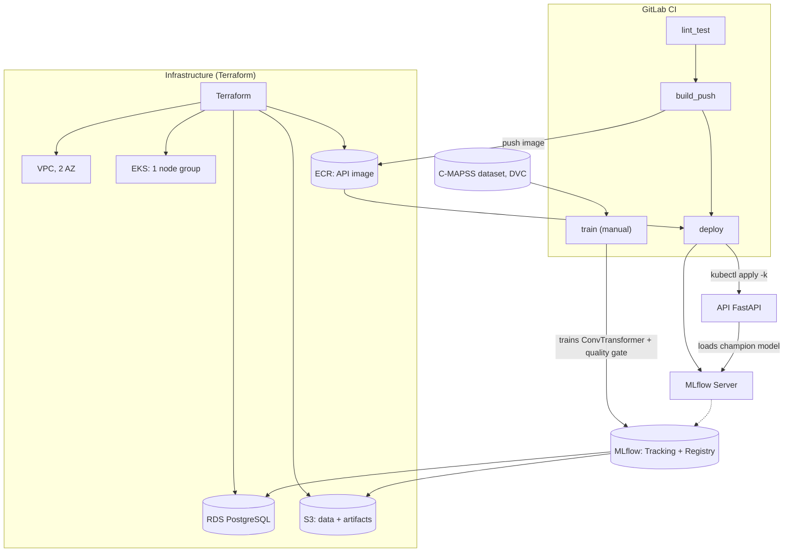

# Predictive Maintenance MLOps

**MLOps platform for turbofan engine Remaining Useful Life (RUL) classification**

*Leer esto en otros idiomas: [Español](README_es.md)*

[](LICENSE)
[](api/pyproject.toml)
[](core_ml/src/train.py)
[](core_ml/src/train.py)
[](kubernetes/base)
[](terraform)
[](.gitlab-ci.yml)

## What this project does

Predicts turbofan engine degradation using NASA's C-MAPSS dataset. The problem is framed as a 3-class classification — **Healthy**, **Alert**, **Critical** — served by a **ConvTransformer** (a `Conv1d` layer feeding a `TransformerEncoder`) trained in PyTorch.

The interesting part isn't just the model: it's everything wired around it to make a prediction trustworthy and reproducible. Raw sensor logs go through versioned, schema-validated data preparation; every training run is tied to the exact code, data and container image that produced it; a promotion gate keeps a model that can't reliably catch the "about to fail" class out of production; and the whole thing ships to a real Kubernetes cluster through infrastructure-as-code, not by hand.

Each layer solves a concrete problem in this specific pipeline: DVC pins *which* dataset produced a model, Pandera/Pydantic contracts catch malformed telemetry before it wastes a training run, MLflow's Model Registry is the single source of truth for "which model is currently serving," and the FastAPI layer trusts that registry instead of a `.pkl` file someone copied around.

## Architecture



**Flow, in words:**

1. Raw C-MAPSS data (versioned with DVC) is turned by `prepare_training_data.py` into 30-timestep sliding windows (`engine_features.parquet` + `scaler.joblib`).
2. `train.py` trains the ConvTransformer and logs the run to MLflow (model + scaler + metrics + lineage tags). It only moves to the `champion` alias if it beats the quality gate.
3. The FastAPI service loads the `champion` model and its scaler from MLflow on startup, and serves `/predict`.
4. GitLab CI: `lint_test` (ruff + pytest) → `build_push` (build + push to ECR) → `deploy` (`kubectl apply -k` straight against the cluster). `train` is a separate manual job, since a full training run can take from minutes to hours and shouldn't block every push.

**A few design choices worth calling out:**

- **Inference is synchronous, on demand.** A client sends one window of readings to `/predict` and gets a classification back in the same request — there's no message broker or streaming layer in the path, because nothing in this system needs to react to a continuous feed faster than a request/response cycle allows.
- **Features are computed once, offline.** `prepare_training_data.py` turns raw telemetry into the exact tensor shape the model consumes, and `train.py` reads that parquet directly. Since predictions are served from a window the caller supplies rather than from live, constantly-refreshed feature values, there's no separate online store to keep in sync.
- **Deployment is a single, auditable step.** The `deploy` stage in CI authenticates to AWS via OIDC and runs `kubectl apply -k` against the rendered overlay. From a merged commit to a running pod there is exactly one system involved, which keeps the path easy to trace when something needs debugging.
- **Secrets are plain Kubernetes Secrets.** RDS credentials, the MLflow URI and the API key are delivered to pods through `envFrom: secretRef` (`kubernetes/base/secret.yaml`), which keeps credential distribution declarative and defined right alongside the workloads that consume it.
- **S3 access rides on the node group's IAM role.** Every pod in the cluster inherits the same scoped read/write policy for the DVC and MLflow buckets, so there's one policy to reason about instead of one per service.

## Tech stack

| Category | Tools |
| --- | --- |
| Machine Learning | PyTorch (CPU-only), ConvTransformer |
| Tracking / Model Registry | MLflow |
| Data & contracts | DVC (S3 remote), Pandera, Pydantic |
| Serving API | FastAPI, Uvicorn |
| Containers / Orchestration | Docker, Docker Compose, Kubernetes (EKS), Kustomize |
| Infrastructure as Code | Terraform (VPC, EKS, RDS, S3, ECR, IAM/OIDC) |
| CI/CD | GitLab CI, AWS auth via OIDC |
| Code quality / observability | Ruff, mypy (optional), pytest, pre-commit, structlog |

## The MLOps pipeline

**Data.** Each stage validates its own output against an explicit schema (`core_ml/src/data_contracts.py`, using Pandera) before letting the next, more expensive stage run. A malformed dataset or a `NaN` reading is rejected immediately. RUL is derived per engine as `max(cycle) - cycle` and grouped into 3 classes: `RUL > 60` → Healthy, `30 < RUL <= 60` → Alert, `RUL <= 30` → Critical.

**The model.** `ConvTransformer` (`core_ml/src/train.py`) runs a `Conv1d` layer over the 30-timestep window to extract local sensor patterns, adds sinusoidal positional encoding, and feeds a 2-layer `TransformerEncoder` that models long-range dependencies. It was selected after benchmarking 5 architectures on this same C-MAPSS task.

**Quality gate.** A model is evaluated on a validation split grouped *by engine* (never row by row: sliding windows overlap heavily, and an IID split would leak near-duplicates between train and val). Promotion to the `champion` alias requires beating **two** thresholds in `config/config.yaml`: `f2_weighted_threshold` **and** `critical_recall_threshold` (a hard floor on the Critical class recall specifically, so a model can't compensate for failing on the class that matters most with good performance on the other two). It's a direct metric comparison against the current champion.

**Toy dataset.** `core_ml/data_toy/` (~1000 rows, versioned with DVC) lets the whole pipeline run in seconds, without a GPU — this is what `make smoke-test` and the CI `lint_test` job run before touching the full dataset.

**Serving.** `api/main.py` loads the `champion` model and its `StandardScaler` from MLflow on startup. The input shape is inferred from the served model's signature, not from a hardcoded constant, so the API contract automatically follows whatever model gets promoted.

## API reference

| Endpoint | Method | Description |
| --- | --- | --- |
| `/health` | `GET` | `200` with `{"status": "ok", "model_version": "<n>", "window_size": <n>, "num_features": <n>}` if a `champion` model is loaded; `503` otherwise |
| `/predict` | `POST` | Requires an `X-API-Key` header. Body: `{"engine_id": "...", "readings": [[...], ...]}` (one row per timestep). Returns `{"engine_id": "...", "prediction": "Healthy"\|"Alert"\|"Critical", "model_version": "<n>"}` |

`/health` is used as the readiness probe. The liveness probe uses a plain TCP check (not `/health`): a healthy pod that doesn't have a `champion` model yet is a business state, not a dead process, and shouldn't be restarted in a loop over it.

## Repository structure

```text
.
├── api/                    # FastAPI serving microservice (own Poetry project)
│   ├── main.py               # Loads models:/<name>@champion and serves /predict
│   └── tests/                 # Unit tests (TestClient/mocks)
├── core_ml/                # Data + training (own Poetry project)
│   ├── src/
│   │   ├── data_contracts.py    # Pandera contracts (fail fast)
│   │   ├── data_processing.py   # Cleanup + sliding windows + scaler
│   │   ├── prepare_training_data.py  # Generates engine_features.parquet
│   │   └── train.py             # ConvTransformer + quality gate + MLflow
│   ├── data/ · data_toy/        # Datasets (DVC-versioned, gitignored)
│   └── tests/                    # Unit tests
├── config/config.yaml       # Global config (validated with Pydantic)
├── kubernetes/
│   ├── base/                # Namespace, ServiceAccount, Secret, ConfigMap,
│   │                          #   api/mlflow Deployments, HPA
│   └── overlays/production/ # Image tag (kustomize edit set image)
├── terraform/                # VPC, EKS, RDS, S3, ECR, IAM (CI OIDC)
│   └── bootstrap/              # One-time: S3+DynamoDB state backend
├── localstack/init-aws.sh   # LocalStack bootstrap (simulated S3 locally)
├── .gitlab-ci.yml           # lint_test → build_push → deploy → train (manual)
├── Makefile                 # Single command interface (local + CI)
├── docker-compose.yml       # Local stack: Postgres, MLflow, API, LocalStack
└── Dockerfile                # API image
```

## Running it locally

### 1. Prerequisites

Python 3.12, Poetry 2.4.1, Docker (with Compose v2), `make`, `pre-commit`.

### 2. Install dependencies and hooks

```bash
pip install "poetry==2.4.1" pre-commit
make install              # api/ and core_ml/, with dev dependencies
make precommit-install    # enables git hooks
```

### 3. Code quality and tests

```bash
make lint       # ruff check
make format     # ruff format (auto-fixes)
make typecheck  # mypy (optional, doesn't block CI)
make test       # pytest in api/ and core_ml/
make ci         # same as the lint_test job in GitLab CI
```

### 4. Validate the pipeline with the toy dataset (seconds, no GPU)

```bash
make dvc-pull    # downloads data/ and data_toy/ from the DVC S3 remote
make smoke-test  # contracts + training + MLflow + quality gate
```

`make smoke-test` is self-contained: without `MLFLOW_TRACKING_URI` exported, it falls back to an ephemeral SQLite tracking store.

### 5. Bring up the full stack with Docker Compose

```bash
make compose-up   # Postgres, MLflow, API, LocalStack
make compose-ps   # healthcheck of every service
```

| Service | URL on the host |
| --- | --- |
| API | `http://localhost:8001` (`/health`, `/predict`, `/docs`) |
| MLflow UI | `http://localhost:5001` |
| LocalStack | `http://localhost:4567` |
| Postgres | `localhost:5433` |

`/health` returns `503` until a model has the `champion` alias in this local MLflow — that's the expected starting state:

```bash
export MLFLOW_TRACKING_URI=http://localhost:5001
make train-toy
docker compose restart api
```

Host ports are shifted (8001, 5001, 4567, 5433 instead of the defaults) so this stack can run alongside other projects on the same machine without port conflicts; the containers' internal ports don't change.

## Training the model

```bash
make dvc-pull      # pulls the full core_ml/data/
make train         # prepares features + trains (25 epochs, patience 5) + quality gate
```

Under the hood, `make train` chains the two stages of the pipeline:

1. **`prepare_training_data.py`** reads the raw C-MAPSS `.txt` files, cleans and windows them (`data_processing.py`), and writes `engine_features.parquet` + `scaler.joblib` into the same DVC-tracked data directory.
2. **`train.py`** loads that parquet, validates it against its data contract, trains the `ConvTransformer` with an engine-grouped train/val split, and logs the run to MLflow — model, scaler, metrics, and a lineage tuple of `git commit + DVC data hash + hyperparameters + MLflow run ID + container image tag`. It only promotes the run to the `champion` alias if it clears the quality gate.

`train.py` is reproducible (`torch.manual_seed(42)`, a seeded train/val split grouped by engine): given an MLflow run, you can always reconstruct which commit, which data version, and which image produced it, via the run's lineage tags. In GitLab CI, the `train` job is manual (it doesn't run on every push) because training against the full dataset can take minutes to hours.

## Serving predictions

Once a model has been promoted to `champion`, `api/main.py` loads it and its scaler from the MLflow Model Registry on startup and exposes `/predict`. A request looks like:

```bash
curl -X POST http://localhost:8001/predict \
  -H "Content-Type: application/json" \
  -H "X-API-Key: local-dev-only-key-change-me" \
  -d '{"engine_id": "FD001_23", "readings": [[...30 rows of sensor values...]]}'
```

The response carries the predicted class (`Healthy` | `Alert` | `Critical`) and the model version that produced it, so callers can always tell which registered model answered a given request. Requests with the wrong window shape, non-finite sensor values, or a missing/blank `engine_id` are rejected with a `422` before they reach the model (`api/schemas.py`); requests without a valid `X-API-Key` are rejected with `401`.

## Deploying to AWS

This assumes your own AWS account and costs real money (EKS + RDS + a NAT Gateway, even with small instances). Steps, in order:

```bash
# 1. One-time: Terraform's remote state backend
cd terraform/bootstrap && terraform init && terraform apply
# copy the "backend_config" output into the "s3" backend in terraform/provider.tf

# 2. Provision the infrastructure and point kubectl at the new cluster
cd terraform && terraform init -migrate-state && terraform apply
aws eks update-kubeconfig --name predictive-maintenance-mlops --region us-east-1

# 3. Fill in the Kubernetes Secret with real credentials
#    (terraform output -raw db_password / db_username; see kubernetes/base/secret.yaml)
kubectl create secret generic mlops-secrets -n mlops-env \
  --from-literal=POSTGRES_USER=<...> --from-literal=POSTGRES_PASSWORD=<...> \
  --from-literal=POSTGRES_DB=mlflow_db --from-literal=API_KEY="$(openssl rand -hex 32)" \
  --dry-run=client -o yaml | kubectl apply -f -

# 4. Build + push the API image, and deploy
make docker-build docker-push deploy IMAGE_TAG=$(git rev-parse --short HEAD)
```

In GitLab CI, the `build_push` and `deploy` stages do this automatically on every push (authenticating against AWS via OIDC, no static credentials — see `terraform/iam.tf`). `make k8s-build` renders the overlay for inspection before applying; `make k8s-diff` shows the diff against the live cluster.

Terraform provisions a VPC across 2 availability zones, a single-node-group EKS cluster, an RDS PostgreSQL instance (MLflow's backend store), an S3 bucket (DVC data + MLflow artifacts), an ECR repository for the API image, and the IAM roles/OIDC providers CI needs to authenticate without long-lived credentials.

## Testing and code quality

| Aspect | Tool | Command |
| --- | --- | --- |
| Lint | [Ruff](https://docs.astral.sh/ruff/) | `make lint` |
| Formatting | Ruff format | `make format-check` |
| Static typing (optional) | [mypy](https://mypy-lang.org/) | `make typecheck` |
| Unit tests | [pytest](https://docs.pytest.org/) | `make test` |
| File/YAML hygiene | pre-commit hooks | `make precommit-run` |

`make ci` runs the same thing as the `lint_test` job in `.gitlab-ci.yml`: if it's green locally, the CI pipeline should be green too. Both `api/` and `core_ml/` are independent Poetry projects with their own `pyproject.toml`, lockfile, and test suite, and pre-commit runs the same ruff/mypy/pytest commands against whichever project's files changed in a commit.

## License

Distributed under the MIT License. See [`LICENSE`](LICENSE) for the full text.

**Author:** Armando Guarnera — [github.com/arguar13](https://github.com/arguar13)
