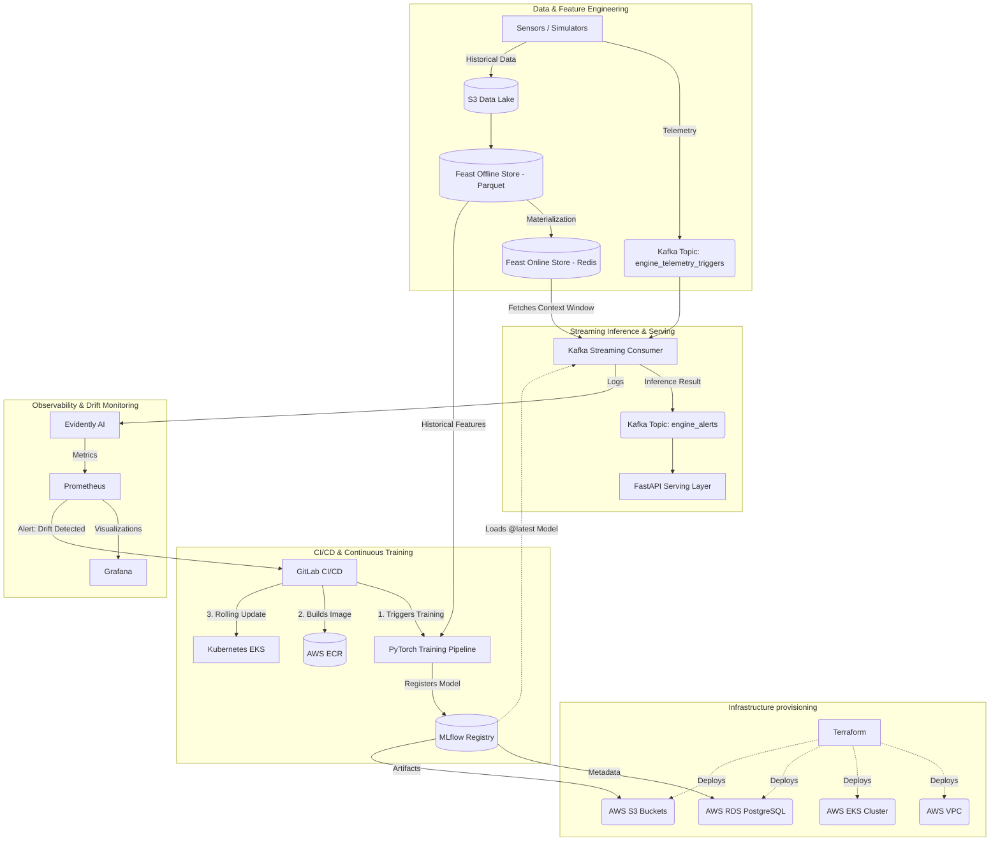

# Predictive Maintenance MLOps System

## Overview and Problem Statement

In industrial environments, unexpected equipment failure leads to severe operational downtime and financial losses. The core challenge is not simply developing a predictive model, but operationalizing it to process high-throughput sensor telemetry, guarantee preprocessing consistency between training and inference, and autonomously adapt to data degradation over time.

This project implements an Enterprise-grade **Machine Learning Operations (MLOps)** architecture designed to predict turbofan engine degradation (C-MAPSS dataset) in real time. It formulates the Remaining Useful Life (RUL) estimation as a multiclass classification problem (**Healthy**, **Alert**, **Critical**) through a Fully Convolutional Network (FCN).

The system completely decouples the data engineering pipeline from model inference using a Feature Store, utilizes Infrastructure as Code (IaC) for immutable cloud deployments, and ensures strict reproducibility through deterministic dependency management and continuous integration pipelines.

---

## System Architecture

The architecture is event-driven, scalable, and built strictly on cloud-native MLOps principles.



---

## Core Engineering Principles

### 1. Feature Store (Feast) Integration

To eliminate Training-Serving Skew, **Feast** is utilized as the central source of truth for data transformations.

#### Offline Store (S3/Parquet)

Provides point-in-time correctness for the PyTorch training pipeline, preventing data leakage during historical sliding window generation.

#### Online Store (Redis)

Serves precomputed feature vectors (30×14 multidimensional arrays) at ultra-low latency. The streaming consumer only receives lightweight event triggers, delegating state management to the Online Store.

---

### 2. Infrastructure as Code (Terraform)

AWS cloud resources are defined declaratively, ensuring complete environment reproducibility and modularity.

#### VPC & Subnet Isolation

EKS worker nodes reside in private subnets, while the RDS MLflow backend is isolated in dedicated database subnets.

#### Security & IRSA

Security Groups strictly limit RDS access to EKS nodes. IAM Roles for Service Accounts (IRSA) are configured to grant pods granular S3 access via OIDC, eliminating static credential usage.

#### ECR Lifecycle Policies

Automated retention rules prevent uncontrolled storage costs.

---

### 3. Continuous Integration & Deployment (GitLab CI)

Manual workflows are replaced with a robust `.gitlab-ci.yml` pipeline authenticated through AWS OIDC.

The pipeline automates:

- Data extraction via DVC.
- Model retraining upon merges into the `main` branch or monitoring alerts.
- Docker image construction and push to Amazon ECR.
- Zero-downtime rolling deployments to Kubernetes using `kubectl`.

---

### 4. Deterministic Dependency Management (Poetry & DevContainers)

Ensures the "it works on my machine" anti-pattern is fully eliminated.

#### Poetry

Resolves and locks dependency trees, including hashes and exact package versions, guaranteeing parity between local development and production environments.

#### DevContainers

Isolates the local development environment using Docker-in-Docker. Opening the project in VS Code automatically provisions a clean, immutable workspace with the required Python and IaC toolchain.

---

### 5. Drift Monitoring & Automated Retraining

- Inference data streams are asynchronously evaluated by **Evidently AI** against reference distributions.
- Metrics are collected and exposed through **Prometheus**.
- If Data Drift or Concept Drift exceeds predefined thresholds, an automated trigger is sent to GitLab CI.
- The retraining pipeline fetches the latest labeled data from the Offline Feature Store and registers an updated model version.

---

## Directory Structure

```text
.
├── .devcontainer/             # Immutable development environment definitions
├── api/                       # FastAPI application for downstream consumers
├── config/                    # Global configuration parameters
├── data/                      # C-MAPSS raw datasets
├── feature_store/             # Feast entity and feature view definitions
├── kubernetes/                # Kubernetes deployment manifests
├── models/                    # Local scaler/model artifacts fallback
├── monitoring/                # Evidently AI and Prometheus configurations
├── src/                       # PyTorch model definitions and data pipelines
├── streaming/                 # Event-driven inference and Kafka consumers
├── terraform/                 # Modularized AWS infrastructure provisioning
├── .gitlab-ci.yml             # CI/CD pipeline definition
├── docker-compose-local.yml   # Local integration testing stack
├── Dockerfile                 # Multi-stage container definition
├── pyproject.toml             # Poetry dependency and project configuration
└── producer_sim.py            # Telemetry ingestion simulator
```

---

## Local Development & Testing

### 1. Initialize Development Environment

Open the repository in VS Code and select:

```text
Reopen in Container
```

### 2. Install Dependencies

```bash
poetry install
```

### 3. Launch Local Integration Stack

Start Kafka, Redis, PostgreSQL, and MLflow locally:

```bash
docker-compose -f docker-compose-local.yml up -d
```

### 4. Simulate and Monitor

Trigger the streaming pipeline and monitor feature delivery locally before pushing code to the repository.

---

## Technology Stack

### Machine Learning

- PyTorch
- Fully Convolutional Networks (FCN)
- MLflow
- Evidently AI

### Feature Engineering

- Feast
- Redis
- Apache Parquet

### Data Streaming

- Apache Kafka

### API Serving

- FastAPI

### Containerization & Orchestration

- Docker
- Kubernetes (Amazon EKS)

### Cloud Infrastructure

- AWS VPC
- AWS EKS
- AWS RDS PostgreSQL
- AWS S3
- AWS ECR

### Infrastructure as Code

- Terraform

### CI/CD

- GitLab CI/CD
- AWS OIDC Authentication

### Monitoring & Observability

- Prometheus
- Grafana
- Evidently AI

### Development Environment

- Poetry
- DevContainers
- VS Code