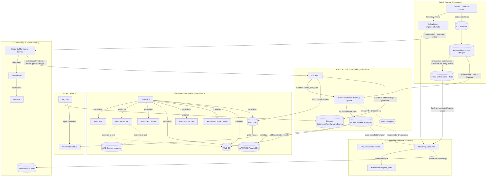

# Predictive Maintenance MLOps

**End-to-end MLOps platform for real-time Remaining Useful Life (RUL) classification on turbofan engines**

*Read this in other languages: [Español](README_es.md)*

[](LICENSE)
[](api/pyproject.toml)
[](core_ml/src/train.py)
[](core_ml/src/train.py)
[](docker-compose.yml)
[](kubernetes/base)
[](terraform)
[](.gitlab-ci.yml)
[](https://github.com/psf/black)

---

## Table of Contents

1. [Executive Summary](#executive-summary)
2. [System Architecture](#system-architecture)
3. [Technology Stack](#technology-stack)
4. [The MLOps Pipeline](#the-mlops-pipeline)
5. [Monitoring & Observability](#monitoring--observability)
6. [Architectural Decisions & Trade-offs](#architectural-decisions--trade-offs)
7. [API Reference](#api-reference)
8. [Repository Structure](#repository-structure)
9. [Getting Started](#getting-started)
10. [Quality & Security Gates](#quality--security-gates)
11. [Possible Extensions](#possible-extensions)
12. [License](#license)

---

## Executive Summary

**The problem.** In industrial environments, unplanned equipment failure causes severe operational downtime, safety risk, and unplanned maintenance cost. Predicting *when* a machine is about to fail is a well-studied modeling problem; the much harder, and much more valuable, problem is operationalizing that prediction — processing high-throughput sensor telemetry continuously, guaranteeing that the exact same feature transformations are applied at training time and at inference time, and allowing the system to detect its own degradation and retrain itself without manual intervention.

**The solution.** This project implements a production-grade MLOps platform that predicts turbofan engine degradation (NASA C-MAPSS dataset) in real time. Remaining Useful Life (RUL) estimation is framed as a three-class classification problem — **Healthy**, **Alert**, **Critical** — served by a **ConvTransformer** (a Conv1d front-end feeding a Transformer encoder) trained in PyTorch, selected over four alternatives in an in-house benchmark. Around that model sits the part that actually makes it operable in production: a Feature Store that eliminates training/serving skew, a Model Registry that gates every deployment behind a measurable accuracy threshold, a streaming pipeline that turns raw Kafka messages into predictions with bounded retries and a circuit breaker, and a GitOps delivery path where the cluster can never silently drift from what was reviewed and merged.

**The value.** Every architectural decision in this repository optimizes for the same outcome: **failures caught locally, cheaply, and early — before they reach a customer, a GPU bill, or a production cluster.** Concretely: a data-contract violation is rejected before a training run ever starts, rather than surfacing as a corrupted model three stages later; a pipeline-breaking bug is caught in seconds against a fixed toy dataset instead of after a multi-hour run against the full dataset; a bad Kubernetes manifest is a `kustomize edit` that either applies cleanly or fails loudly, never a `sed` that silently no-ops; a manual `kubectl apply` against a live cluster is structurally impossible, because the pipeline itself no longer holds cluster credentials — only ArgoCD does, and it continuously reconciles the cluster to match Git. The result is a system where a new engineer can trust that "it passed CI" actually means something, and where a model only ever reaches the customers relying on it if it has proven itself against an explicit, auditable quality bar.

---

## System Architecture

The architecture is event-driven, cloud-native, and deliberately decouples every stage of the ML lifecycle so that each one can fail, scale, and be tested independently.



### Data Flow, in Words

1. **Ingestion.** Sensor telemetry arrives either as a continuous stream (Kafka topic `engine_telemetry`) or as historical batches landed in the S3 data lake.
2. **Feature engineering.** Historical data is transformed into fixed-size sliding windows (30 timesteps x 24 features — see the note on window shape below) and written to the **Feast Offline Store** (S3/Parquet), which guarantees point-in-time correctness — no future data ever leaks into a training window. Those same feature definitions are materialized into the **Feast Online Store** (Redis) for low-latency lookups at inference time. `train_model` only runs `feast apply`, which registers the entity/feature-view *schema* — it never touches the online store. A dedicated Kubernetes `CronJob` (`kubernetes/base/feast-materialize-cronjob.yaml`) runs `feast materialize-incremental` every 30 minutes, inside the cluster, because ElastiCache sits in private subnets the CI runner cannot reach. Training and serving read from the same feature definitions, by construction: training/serving skew is not something this system has to be careful about, it is something the architecture makes structurally impossible.
3. **Training.** The `train_model` job rebuilds the feature parquet (`prepare_feast_data.py`), uploads it to the S3 path `feature_store/features.py` declares, runs `feast apply` to register the schema in the S3-backed Feast registry, then pulls point-in-time-correct historical features back out of the offline store, trains the ConvTransformer in PyTorch (`--epochs 25 --patience 5`), and logs the run to MLflow — model weights, the fitted `StandardScaler`, hyperparameters, and a full reproducibility tuple (Git commit SHA, DVC data hash, MLflow run ID, container image tag).
4. **Quality gate.** A trained model is evaluated on a held-out validation split, split by *engine* (not by row — sliding windows from the same engine overlap heavily, so a row-level split would leak near-duplicates across train/val). Promotion to the `champion` alias requires clearing *two* independent thresholds in `config/config.yaml`: `monitoring.f2_weighted_threshold` (F2 weights recall twice precision across the three classes) **and** `monitoring.critical_recall_threshold` (a hard floor on recall for the Critical class specifically — a model can post a strong weighted F2 while still failing to catch the one class where a false negative is most expensive, and this floor is what catches that case). Anything that doesn't clear both bars stays registered, for audit, but is never served.
5. **Delivery.** GitLab CI builds and pushes container images to ECR, then updates the image tag declared in `kubernetes/overlays/production` and commits that change to Git. It never touches the cluster directly.
6. **Reconciliation.** ArgoCD, running inside the cluster, watches that path in Git and continuously reconciles the live cluster state to match it (`selfHeal: true`) — any out-of-band `kubectl edit` is automatically reverted.
7. **Inference.** The streaming consumer picks up a telemetry event, fetches the corresponding precomputed feature vector from the Feast online store (Redis), runs inference with the `champion`-aliased model, and publishes the classification (`Healthy` / `Alert` / `Critical`) to the `engine_alerts` Kafka topic. The FastAPI service exposes the same `champion` model synchronously over `/predict`, for on-demand scoring.
8. **Observability.** Every inference the consumer serves is logged as structured JSON. Independently, a dedicated **Evidently monitoring service** (`monitoring/`, its own Kafka consumer group on `engine_telemetry`) batches raw telemetry and evaluates it against a reference distribution — deliberately decoupled from the inference hot path, so drift computation can never add latency to, or crash, `/predict`. Prometheus scrapes the resulting drift metrics; Grafana visualizes them; and if drift crosses `monitoring.drift_threshold`, the service itself calls the GitLab API directly (`POST /pipeline`, authenticated with a token from Secrets Manager) to fire the retraining pipeline — closing the loop without a human needing to notice the model has gone stale.

---

## Technology Stack

| Category | Tools | Purpose in this project |
| --- | --- | --- |
| **Machine Learning** | PyTorch (CPU-only wheels), ConvTransformer (Conv1d + sinusoidal positional encoding + `TransformerEncoder`) | Multiclass RUL classification (Healthy / Alert / Critical) from sensor windows, with early stopping on the best validation checkpoint |
| **Tracking & Model Registry** | MLflow | Experiment tracking, artifact storage, and the *only* source of truth for which model version is servable (`champion` alias) |
| **Feature Store** | Feast, Redis, Apache Parquet | Point-in-time-correct offline training features + low-latency online feature serving, eliminating training/serving skew |
| **Data Versioning & Contracts** | DVC (S3 remote), Pandera, Pydantic | Reproducible dataset versioning; fail-fast schema validation at every pipeline stage |
| **Data Streaming** | Apache Kafka (Amazon MSK in production) | Decoupled, durable transport for telemetry ingestion and alert publishing |
| **API Serving** | FastAPI, Uvicorn | Synchronous, self-documenting, type-validated inference endpoint |
| **Containerization & Orchestration** | Docker, Docker Compose, Kubernetes (Amazon EKS), Kustomize | Local parity with production; declarative, environment-layered manifests |
| **GitOps & Delivery** | ArgoCD, External Secrets Operator | Pull-based, self-healing cluster reconciliation; secrets synced from AWS Secrets Manager, never committed |
| **Infrastructure as Code** | Terraform | Declarative, reproducible provisioning of the entire AWS footprint |
| **Cloud Infrastructure** | AWS VPC, EKS, RDS (PostgreSQL), MSK, ElastiCache (Redis), S3, ECR, Secrets Manager, KMS (customer-managed key), CloudWatch Logs, DynamoDB (Terraform state lock), IAM (OIDC federation, IRSA) | Managed, private-by-default infrastructure with no long-lived static credentials |
| **Local Integration Testing** | Testcontainers, LocalStack | Real, ephemeral Postgres/Kafka/S3/SQS/Secrets Manager containers proving actual integration, at zero cloud cost |
| **Monitoring & Observability** | Evidently AI (standalone Kafka-consuming service), Prometheus, Grafana, structlog, tenacity, pybreaker | Data drift detection decoupled from the inference path, metrics, JSON-structured logs, bounded retries, circuit breaking |
| **CI/CD** | GitLab CI/CD, AWS OIDC, gitlab-ci-local, self-hosted GitLab Runner | Quality gates, smoke testing, training, image builds, and GitOps releases — runnable identically outside GitLab, and executable on local hardware with zero shared-runner minutes spent |
| **Development Environment** | Poetry, DevContainers, VS Code, Make | Deterministic, reproducible local environments; a single command interface shared with CI |
| **Code Quality & Security** | Ruff, Black, isort, mypy, pytest, Bandit, Trivy, yamllint, pre-commit | Shift-left quality gates enforced identically pre-commit and in CI |

---

## The MLOps Pipeline

### Data Pipeline

Every stage of the data pipeline validates its own output against an explicit schema **before** the next, more expensive, stage is allowed to run (see `core_ml/src/data_contracts.py` for Pandera contracts on raw telemetry, labeled telemetry, and windowed features; `api/schemas.py` for the Pydantic contract on inference requests; `api/config_schema.py` / `core_ml/src/config_schema.py` for config validation). A malformed dataset, a `NaN` sensor reading, an out-of-range configuration value, or a wrongly shaped inference request is rejected immediately — never allowed to reach a model forward-pass and fail in some more confusing, more expensive way downstream.

**Labels.** RUL is derived per engine as `max(cycle) - cycle`, then bucketed into the three served classes: `RUL > 60` is **Healthy**, `30 < RUL <= 60` is **Alert**, and `RUL <= 30` is **Critical** (`build_multiclass_target` in `core_ml/src/data_processing.py`).

**A note on window shape.** `num_features` is a property of the *dataset*, not a constant of the project: `clean_and_prepare` drops sensors whose variance is effectively zero, computed on the data actually loaded. The toy dataset (only `train_FD001.txt`, a single operating condition) yields a different count than the full FD001–FD004 combination, where no sensor is invariant across the six operating conditions — 24 features. `config/config.yaml` declares `num_features: 24` for the components that need it up front (`producer_sim.py`, the Evidently service), but `api/main.py` deliberately ignores it at runtime and derives the real shape from the served model's MLflow signature, falling back to `scaler.n_features_in_`. That way `/predict`'s contract follows whatever model is promoted to `champion`, instead of drifting away from a hand-edited YAML value — a mismatch that previously made a correct prediction impossible and only surfaced request by request.

A fixed, deterministic ~1,000-row **toy dataset** (`core_ml/data_toy/`, regenerated reproducibly by `core_ml/scripts/build_toy_dataset.py`, versioned with DVC) lets the entire pipeline — contracts, feature preparation, training, MLflow logging, quality-gate evaluation, registry promotion — run end-to-end in seconds on a laptop, with no GPU and no Feast/S3/Redis dependency. This is what `make smoke-test` runs (against an ephemeral SQLite tracking store, and with `--no-enforce-quality-gate`: the gate is still evaluated and tagged on the run, but a ~1,000-row sample is not a basis for failing a build on model quality). GitLab CI enforces that it passes *before* the real `train` stage against the full dataset is allowed to start.

### Training Pipeline

Training is triggered by a merge into the main branch or by an automated drift alert. The `train_model` job pulls point-in-time-correct historical features from the Feast offline store, trains the ConvTransformer, and tags the resulting MLflow run with a full reproducibility tuple: **Git commit SHA + DVC data hash + hyperparameters + MLflow run ID + container image tag** (`_build_lineage_tags` in `core_ml/src/train.py`). Given any model version ever deployed, every one of those five coordinates can be recovered — there is no "which commit produced this model" archaeology.

**The model.** `ConvTransformer` (`core_ml/src/train.py`) runs a `Conv1d` front-end over the 30-timestep window to extract short-range sensor patterns, adds sinusoidal positional encoding, and feeds a two-layer `TransformerEncoder` (d_model 64, 4 heads, dropout 0.3) that models long-range dependencies across the window, then global-average-pools over time into a three-class head.

**Training is bounded, not open-ended.** `--epochs 25` is a *ceiling*, not a target: `--patience 5` stops as soon as five consecutive epochs fail to improve weighted F2 (the same metric the quality gate checks — picking the checkpoint by one metric and gating promotion by another would let a model become "best" without being the model the gate actually wants), and the best checkpoint is always restored — never the last epoch. That last part is not a convenience: on the full dataset (far more overlap between sliding windows than in the toy set) validation accuracy was observed collapsing to 0.18 by epoch 20 while training loss kept falling, so "train longer" without best-checkpoint restore is a bet that can land on a bad peak. `torch.manual_seed(42)` makes runs reproducible, and the train/val split itself is seeded and engine-grouped, so the same commit plus the same data cannot clear the quality gate on one pipeline run and fail on the next.

There is no `model.pkl` or `scaler.joblib` sitting loose in a directory anywhere in this system. `train.py` logs the PyTorch model **and** the fitted `StandardScaler` as artifacts of the same MLflow run, and registers the model version in the MLflow Model Registry. A version is only promoted to the `champion` alias — the one both `api/main.py` and the streaming consumer actually load (`models:/<name>@champion`) — if it clears the quality gate; otherwise it stays registered for audit but never reaches serving.

### Deployment Pipeline (CI/CD)

```
push / merge to main
      │
      ▼
 quality        →  make ci (format, lint, types, unit tests, SAST, secret/CVE/IaC scan, YAML lint)
      │
      ▼
 smoke_test     →  full pipeline mechanics proven against the toy dataset in seconds
      │
      ▼
 data_pull      →  dvc pull (full C-MAPSS dataset)
      │
      ▼
 train          →  prepare features + S3 upload + feast apply; train against the full dataset
                   via Feast (epochs 25, patience 5); quality-gated promotion to `champion`
      │
      ▼
 build_image    →  build + push all four images (API, streaming-consumer, monitoring, MLflow) to ECR
      │
      ▼
 release        →  kustomize edit set image + git commit/push (NOT a cluster deployment)
      │
      ▼
 ArgoCD         →  detects the commit, reconciles the cluster (sync + selfHeal)
```

The `release` stage is deliberately the least powerful stage in the pipeline: it never authenticates to EKS, never runs `kubectl`, and cannot reach the cluster even if compromised. It edits one YAML field through Kustomize's own API and pushes a commit. Everything downstream of that commit is ArgoCD's responsibility, running inside the cluster it manages.

---

## Monitoring & Observability

- **Drift detection, decoupled from serving.** `monitoring/` is its own Poetry project, its own container image, and its own Kubernetes `Deployment` (`kubernetes/base/evidently.yaml`) — it subscribes to `engine_telemetry` as an independent Kafka consumer group, entirely separate from the streaming consumer that actually performs inference. This is deliberate: drift computation is CPU/memory-heavier and slower than a single inference, and giving it its own failure domain means a stuck or crashing drift evaluation can never add latency to, or take down, `/predict` or the streaming consumer. It currently detects **data drift** (input distribution shift) only; concept drift (degradation of the input→label relationship) would require a ground-truth-label topic that doesn't exist anywhere else in this system, so it's left out rather than half-simulated (see [Possible Extensions](#possible-extensions)).
- **How a batch is evaluated.** The service pools each incoming 30×24 window into one row (temporal mean), accumulates `EVIDENTLY_BATCH_SIZE` rows (20 by default), and runs an Evidently `DataDriftPreset` report against a fixed reference distribution, exporting the drifted-column share as `evidently_data_drift_share` alongside `evidently_data_drift_detected` and `evidently_batches_processed_total`. A window whose shape does not match the model's is logged and skipped, never silently reshaped.
- **Metrics & dashboards.** Drift metrics are exposed via `prometheus-client` (`GET /metrics` on the Evidently service), scraped by **Prometheus**, and visualized in **Grafana** — the same stack used to watch latency and throughput of the serving layer. Both run as first-class Deployments in `kubernetes/base/` (`prometheus.yaml`, `grafana.yaml`), not as an afterthought bolted on outside the cluster.
- **Automated retraining.** If drift crosses `monitoring.drift_threshold` (`config/config.yaml`), the Evidently service calls the GitLab API directly (`POST /projects/:id/pipeline`, authenticated with a token synced from AWS Secrets Manager) to trigger a fresh run of the training pipeline against the latest labeled data from the offline feature store — no intermediate alerting system in the loop. A retrained model still has to clear the quality gate before it can replace the current `champion`.
- **Structured logs.** `core_ml/src/logging_config.py` (mirrored in `api/`) configures `structlog` to emit one JSON object per log line — `timestamp` / `level` / `logger` / `event` plus arbitrary context — including third-party stdlib loggers (uvicorn, botocore). Directly queryable in CloudWatch Logs Insights or Kibana; no text parsing required.
- **Resilience under partial failure.** The streaming consumer wraps transient dependency calls (Feast, network) in bounded exponential backoff (`tenacity`, `stop_after_attempt(3)`) and wraps the per-message inference path in a real circuit breaker (`pybreaker`, `fail_max=5`, `reset_timeout=60s`). A downed dependency degrades to fast failures instead of an unbounded retry storm; a single malformed message is caught, logged with full context, and the consumer moves on — it can no longer crash the process.

---

## Architectural Decisions & Trade-offs

Every non-obvious choice below was made deliberately, against a specific alternative — not by default or by fashion.

**FastAPI over Flask.** The serving layer needed native async support (for I/O-bound model/artifact loading and future concurrent request handling), automatic OpenAPI documentation for a service other engineers would integrate against, and first-class Pydantic integration so the inference request contract (`api/schemas.py`) is validated at the framework boundary rather than by hand-written checks scattered through the handler.

**A Feature Store with two physically different stores, not one.** Training needs point-in-time-correct historical windows over potentially huge batches of data; inference needs a single feature vector back in single-digit milliseconds. Trying to serve both needs from one store means compromising one of them. Feast's offline (Parquet/S3) + online (Redis) split lets each side be optimized for what it actually does, while guaranteeing both read the same feature *definitions* — which is the actual mechanism that eliminates training/serving skew, not a policy or a code review checklist.

**GitOps (ArgoCD, pull-based) over CI pushing directly to the cluster.** The earlier version of this pipeline had GitLab CI run `kubectl apply` and `kubectl rollout restart` directly. That means a compromised CI job, or a bad script, has standing credentials to mutate a live cluster. Moving to ArgoCD means CI's blast radius shrinks to "can push container images and edit one YAML file in this repo" — it never holds cluster credentials at all. `selfHeal: true` is the other half of the trade: an emergency `kubectl edit` in production now gets silently reverted by design, which is exactly the property you want once the source of truth is Git and not tribal knowledge of who changed what by hand.

**Kustomize over `sed` against committed YAML.** A previous iteration patched image tags into manifests with `sed -i`, which silently no-ops the moment someone reindents a line or renames a field — a false-negative that fails at the worst possible time. `kustomize edit set image` is a structural edit through the tool's own API: it either succeeds or fails loudly. The base/overlay split also means adding a second environment is a new overlay directory, not a forked copy of every manifest.

**MLflow as the sole Model Registry, gated by a cost-sensitive metric, not plain accuracy.** No script anywhere in this repository copies a model file to a serving location. The only path to production is: train, log to MLflow, clear both `monitoring.f2_weighted_threshold` and `monitoring.critical_recall_threshold` on an engine-grouped held-out split, get promoted to the `champion` alias. Plain accuracy was dropped from the gate deliberately: on an imbalanced 3-class RUL problem, a model can post a high accuracy while rarely catching the Critical class specifically — the one false negative this system exists to avoid — and accuracy alone would never surface that. This removes an entire class of incidents where "someone manually pushed a model" bypasses whatever validation the pipeline was supposed to enforce.

**A ConvTransformer over the FCN baseline.** The original model was a purely convolutional FCN. It was replaced after an in-house benchmark of five architectures on this same class of C-MAPSS task, where the ConvTransformer came out ahead on Macro F1 and accuracy — beating InceptionTime, a vanilla Transformer, PatchTST, and the FCN baseline. A convolution alone sees only a local receptive field over the window; self-attention alone has no notion of the temporal ordering that *is* the signal here. The hybrid gets both, and the positional encoding is what keeps attention from being order-invariant over the 30 timesteps. The benchmark's static/categorical branches (an embedding over `dataset_id`, static numeric features) are deliberately dropped: this project's Feast pipeline only produces `windowed_features`, and importing branches with no upstream to feed them would be architecture theatre.

**CPU-only PyTorch wheels, from an explicit Poetry source.** Nothing in this project calls CUDA — training runs on CPU and the API only does inference — but the default PyPI `torch` wheel for Linux drags in ~2GB of `nvidia-*` packages (cuBLAS, cuDNN, cuFFT, nvshmem) that are never loaded. That weight, duplicated across the API and streaming-consumer images, was the actual cause of `build_image` exhausting the runner's upload bandwidth and blowing the job timeout. Both `pyproject.toml` files pin `torch` to the `pytorch-cpu` source (`download.pytorch.org/whl/cpu`) and to the *same* version, which also matters for correctness: the model is registered with `serialization_format="pickle"`, and a pickled `nn.Module` has no guarantee of loading across a major version gap between the project that wrote it and the one that reads it.

**A toy dataset and a mandatory smoke-test stage, before the real training run.** The same "shift-left" principle usually applied to code (catch a bug in a unit test, not in staging) applies to ML pipelines too. `make smoke-test` exercises the *entire* mechanism — contracts, MLflow logging, the quality gate, registry promotion — against a fixed ~1,000-row dataset in seconds. GitLab CI enforces that this passes before the `train` stage, which reads the full dataset via Feast and can run for hours, is even allowed to start.

**A persistent host Docker daemon and a remote BuildKit cache in ECR, not ephemeral `docker:dind`.** `build_image` used to run against a fresh `docker:dind` service per job — every attempt re-downloaded and rebuilt the ~1GB+ PyTorch dependency layer shared by the API and streaming-consumer images from zero, which reliably timed out against an unstable home-network runner. The job now binds the self-hosted runner's *real* host Docker socket (`/var/run/docker.sock`), and `docker buildx build --cache-from/--cache-to type=registry` persists that layer in a dedicated, mutable ECR repo (`predictive-maintenance-mlops-build-cache`) that only gets re-pushed when the corresponding `poetry.lock` actually changes. The trade-off is explicit: this only works because the runner is self-hosted and trusted — a shared/ephemeral GitLab runner couldn't offer a stable host socket to bind.

**A dedicated MLflow container image (`Dockerfile.mlflow`), not the stock upstream image.** The public `ghcr.io/mlflow/mlflow` image has no Postgres driver, and this project's MLflow backend store is RDS Postgres (`kubernetes/base/mlflow.yaml`) — it crashes on startup with `ModuleNotFoundError: psycopg2`. `Dockerfile.mlflow` layers `psycopg2-binary` on top of the same upstream base and publishes the result to its own ECR repo, so the exact same image serves both `docker-compose.yml` locally and the EKS `Deployment`.

**Testcontainers + LocalStack over mocking external systems in integration tests.** A test that mocks Postgres, Kafka, or S3 can pass while the real integration is broken — the mock and the real system silently drift apart. Testcontainers spins up real, ephemeral containers from pytest itself; LocalStack does the same for AWS (S3, SQS, Secrets Manager) at zero cost and zero credentials. These are slower than mocked tests, so they're excluded from the default `make test` / pre-commit run and executed explicitly via `make test-integration` — a deliberate trade of speed for confidence, made only where the integration actually matters.

**Two independent Poetry projects (`api/`, `core_ml/`) instead of one shared dependency tree.** The serving API and the training/streaming pipeline have very different dependency footprints — Feast, DVC, and Kafka clients have no reason to ship inside the production API image. Splitting them keeps that image's dependency surface, build time, and attack surface minimal, at the cost of some duplicated boilerplate (`config_loader.py`, `logging_config.py`) between the two projects — a trade made deliberately in favor of the API's small footprint.

**A customer-managed KMS key, not AWS-owned default encryption.** The S3 artifact bucket used to encrypt with SSE-S3 and Secrets Manager with its default key. Both work, and both mean you do not control rotation, cannot scope who may decrypt through a key policy, and get no attributable key usage in CloudTrail. One project CMK (`terraform/kms.tf`, rotation enabled) fixes all three for roughly a dollar a month; `bucket_key_enabled = true` on the bucket keeps the KMS call volume — and its cost — sane under MLflow's many-small-objects access pattern.

**A dedicated IAM deployer identity, so nothing is applied as root.** `terraform/bootstrap/iam_deployer.tf` creates a group + user whose access key becomes the identity that runs the main `terraform/` stack and the CLI from then on. That user carries `AdministratorAccess`, which is honest about what it is: hand-scoping a policy for a stack that provisions VPC, EKS with IRSA, RDS, MSK, ElastiCache, S3, ECR, Secrets Manager, CloudWatch Logs, IAM roles *and* an OIDC provider produces a huge, brittle policy that has to be re-edited on every apply. The blast-radius control here is not the policy — it is that this identity can be rotated, attributed by name in CloudTrail, and revoked in seconds, none of which is true of the root account.

**Kafka topics bootstrapped by a script, not by Terraform.** `terraform/msk.tf` provisions the MSK *cluster*, but a Kafka topic is not an AWS resource — it belongs to the Kafka protocol and requires direct network reachability to a broker, which Terraform running outside the VPC does not have (MSK sits in private subnets, by design, like RDS and ElastiCache). Without `core_ml/scripts/bootstrap_kafka_topics.py`, run once per cluster from inside the VPC, both topics simply never existed: producers connected without error and then hung forever in `_wait_on_metadata` on `UNKNOWN_TOPIC_OR_PARTITION`. Same reasoning puts `feast materialize-incremental` in an in-cluster CronJob rather than in a CI job.

**A calibrated security gate with dated, written risk acceptances.** `make security` breaks the build on HIGH/CRITICAL and merely reports the rest, with `--ignore-unfixed`. The earlier version failed on every severity: 144 findings, most of them inside third-party Terraform modules (`terraform-aws-modules/eks`, `/vpc`) this repo cannot edit, which meant `make ci` could never go green. A gate nobody can pass gets switched off, which is strictly worse than a calibrated one. What is genuinely unfixable-from-here lives in `.trivyignore.yaml` as a written justification with an `expired_at` date — when it lapses the finding breaks the build again and the decision gets re-argued, rather than renewed by inertia. Conversely, CVEs that *are* fixable are fixed: both `pyproject.toml` files carry version floors on transitive dependencies (`gunicorn`, `protobuf`) purely to force Poetry off vulnerable resolutions.

**Structured retries and a circuit breaker in the streaming consumer, not a bare `while True` loop.** A naive consumer that retries forever on every failure either hammers a downed dependency into the ground or silently drops messages when it panics and exits. Bounded exponential backoff plus a circuit breaker (fail fast once a dependency is clearly down, recover automatically once it's back) is the standard shape for a production consumer that has to stay up unattended.

---

## API Reference

The FastAPI service loads the `champion`-aliased model and its `StandardScaler` from the MLflow Model Registry at startup. If no model has been promoted yet, the service still starts, but reports itself as not ready.

| Endpoint | Method | Description | Response |
| --- | --- | --- | --- |
| `/health` | `GET` | Readiness probe | `200` with `{"status": "ok", "service": "online", "model_version": "<n>", "window_size": <n>, "num_features": <n>}` if a champion model is loaded; `503` if not |
| `/predict` | `POST` | Scores a sensor window against the champion model | `{"engine_id": "...", "prediction": "Healthy" \| "Alert" \| "Critical", "model_version": "<n>"}` |

The request body shape for `/predict` (a `window_size x num_features` array of sensor readings) is built at runtime from the shape the *served model* declares — its MLflow signature, falling back to `scaler.n_features_in_` — not from `config/config.yaml`, and is validated by the Pydantic contract in `api/schemas.py` before it ever reaches the model. `/health` echoes that shape back so a client can discover it without first provoking a `422`.

Only `/health` is used as the Kubernetes readiness probe. Liveness deliberately uses a plain TCP check instead (`kubernetes/base/api.yaml`): a pod that is running fine but has no `champion` model yet is a business state, not a dead process, and probing `/health` for liveness would restart it in a loop while waiting for the first passing training run.

---

## Repository Structure

```text
.
├── .devcontainer/               # Immutable development environment definition
├── api/                         # FastAPI serving microservice (own pyproject.toml/poetry.lock)
│   ├── main.py                  # Loads models:/<name>@champion; infers window shape from the model
│   ├── schemas.py               # Pydantic contract factory for /predict (fail fast)
│   ├── config_schema.py         # Pydantic contract for config.yaml
│   └── tests/                   # Unit + integration (Testcontainers) tests
├── core_ml/                     # Data pipeline, feature store, training & streaming (own Poetry project)
│   ├── src/
│   │   ├── data_contracts.py    # Pandera data contracts (fail fast) for the data pipeline
│   │   ├── data_processing.py   # C-MAPSS load/label/clean + sliding windows + scaler
│   │   ├── prepare_feast_data.py# Builds engine_features/training_entities/scaler.joblib
│   │   ├── logging_config.py    # structlog JSON logging
│   │   └── train.py             # ConvTransformer + lineage tags + quality gate + registry promotion
│   ├── scripts/                 # build_toy_dataset.py + bootstrap_kafka_topics.py (idempotent topics)
│   ├── streaming/               # kafka_consumer.py (retries + circuit breaker), kafka_security.py (TLS/MSK)
│   ├── feature_store/           # Feast entity + feature view definitions (S3 registry, Redis online store)
│   ├── data/ · data_toy/        # Full + toy datasets (DVC-tracked, gitignored; see *.dvc)
│   ├── tests/                   # Unit + integration (Testcontainers) tests
│   └── Dockerfile               # streaming-consumer image (own ECR repo; also runs the Feast CronJob)
├── config/config.yaml           # Global configuration, validated by both config_schema.py contracts
├── monitoring/                  # Evidently drift-monitoring microservice (own Poetry project + Dockerfile)
│   └── evidently_service.py     # Independent Kafka consumer of engine_telemetry; /metrics; triggers CI on drift
├── kubernetes/
│   ├── base/                    # Kustomize base: api / streaming-consumer / mlflow / evidently /
│   │                            #   prometheus / grafana Deployments + feast-materialize-cronjob.yaml
│   │                            #   + ExternalSecret + ServiceAccount (IRSA) + configMapGenerator
│   └── overlays/production/     # Image tags for all 4 images (kustomize edit set image, never sed)
├── gitops/argocd/               # ArgoCD Application: watches kubernetes/overlays/production
├── terraform/                   # AWS infra (VPC, EKS, RDS, MSK, ElastiCache, S3, ECR, KMS, IAM/OIDC)
│   └── bootstrap/               # One-time, root-only: S3 + DynamoDB state backend and the IAM deployer identity
├── localstack/init-aws.sh       # LocalStack bootstrap (same bucket name as terraform/s3.tf)
├── runner/docker-compose.yml    # Self-hosted GitLab Runner (zero shared-runner minutes)
├── producer_sim.py              # Manual telemetry simulator (run by hand; no image, no Deployment)
├── .gitlab-ci.yml               # CI/CD: quality → smoke_test → data_pull → train → build → release
├── .pre-commit-config.yaml      # Local git hooks: lint, format, type-check, test, secrets, YAML
├── .trivyignore.yaml            # Written, expiry-dated risk acceptances for the security gate
├── Makefile                     # Single execution interface, identical locally and in CI
├── docker-compose.yml           # Local stack: Postgres, Kafka, Redis, MLflow, API, Evidently, LocalStack
├── Dockerfile                   # API service container image
└── Dockerfile.mlflow            # MLflow image + psycopg2 (backend-store-uri is Postgres/RDS)
```

---

## Getting Started

### 1. Prerequisites

Python 3.12, Poetry 2.4.1, Docker (with Compose v2), `make`, and `pre-commit`. See [`Makefile`](Makefile) for the full local-tooling list (Trivy, kustomize, Terraform, kubectl are only needed past the local-development stage).

### 2. Set up the development environment

Open the repository in VS Code and select **Reopen in Container** — this provisions Python, the pinned Poetry version, `make`, and the IaC toolchain, installs both packages' dependencies, and enables the pre-commit hooks automatically.

Outside a DevContainer:

```bash
pip install "poetry==2.4.1" pre-commit
make install                             # installs api/ and core_ml/ (with dev dependencies)
make precommit-install                   # enables the git hooks
```

### 3. Run the everyday quality commands

```bash
make format         # auto-fix formatting + import order (isort + black)
make lint           # ruff
make typecheck      # mypy
make test           # pytest, integration tests excluded (api/ and core_ml/)
make coverage       # the same tests, with a term-missing coverage report
make security       # bandit (SAST) + trivy (secrets, dependency CVEs, IaC)
make yamllint       # every YAML in the repo
make ci             # everything above, exactly as the `quality` stage runs it
```

`make help` lists every target with its one-line description.

### 4. Validate the pipeline before spending real compute

```bash
make dvc-pull       # fetch data/ and data_toy/ from the DVC S3 remote
make smoke-test     # data contracts + training + MLflow + quality gate, on the toy dataset, in seconds
```

`make smoke-test` is self-contained: with no `MLFLOW_TRACKING_URI` exported it falls back to an ephemeral SQLite tracking store, so it runs on a laptop with nothing else started. To work against LocalStack's S3 instead of the real DVC remote, `make dvc-use-localstack` redirects it via `core_ml/.dvc/config.local` — a local-only file; the shared `core_ml/.dvc/config` in git keeps pointing at real S3.

### 5. Launch the full local stack

```bash
make compose-up     # Postgres, Kafka (+ Zookeeper), Redis, MLflow, the API, Evidently, and LocalStack
make compose-ps     # check each service's healthcheck
```

Host ports are deliberately shifted off the defaults, because this machine runs several MLOps projects side by side and 5432/5000/4566/8000 were already taken. Container-internal ports are unchanged, so nothing inside the compose network is affected:

| Service | URL on the host | Container port |
| --- | --- | --- |
| API | `http://localhost:8001` (`/health`, `/predict`, `/docs`) | 8000 |
| MLflow UI / tracking | `http://localhost:5001` | 5000 |
| Evidently drift monitor | `http://localhost:8002/metrics` | 8000 |
| LocalStack | `http://localhost:4567` | 4566 |
| Postgres | `localhost:5433` | 5432 |
| Kafka | `localhost:9092` | 29092 (internal listener) |

The Evidently service consumes `engine_telemetry` as an independent Kafka consumer group, separate from the API and the streaming consumer.

`/health` on the API reports `503` until a model has been promoted to `champion` in this local MLflow — that is the expected initial state, not a broken stack:

```bash
export MLFLOW_TRACKING_URI=http://localhost:5001   # host port; the API talks to http://mlflow:5000 internally
make train-toy
docker compose restart api                          # the API loads the champion model at startup
```

To push telemetry through the stack, create the topics once (`make msk-bootstrap-topics`, with `KAFKA_BROKER=localhost:9092`) and then run `python producer_sim.py`.

### 6. Run the integration test suite (real ephemeral containers)

```bash
make test-integration   # requires Docker; Testcontainers spins up real Postgres/Kafka/LocalStack
```

These are excluded from `make test` and from the pre-commit hooks (`-m "not integration"`), so the fast loop stays fast. They cover the API serving from a real MLflow registry on Postgres, round-tripping messages through a real Kafka broker, and S3/SQS/Secrets Manager against LocalStack.

### 7. Release a new version (GitOps) and validate infrastructure locally

```bash
make docker-build              # builds all 4 images: api + streaming-consumer + monitoring + mlflow
make k8s-build                 # renders kubernetes/overlays/production for inspection
make gitops-release            # commits the new image tag; ArgoCD picks it up from there

make terraform-fmt             # terraform fmt -check -recursive (never apply from here)
make terraform-validate        # syntax/type validation (requires a prior terraform init)
make terraform-plan            # plan against real AWS (requires valid credentials)
make ci-local                  # runs .gitlab-ci.yml locally via gitlab-ci-local
```

`make docker-build` is the local path (Docker Desktop already caches layers between builds). CI uses `make docker-buildx-push` instead: the same four images, built through a `docker-container` buildx driver with a BuildKit registry cache in ECR, and skipped entirely if the tag already exists — which is what makes retrying a partially-failed `build_image` safe against immutable ECR repos.

The one-time, cluster-scoped bootstrap steps that neither Terraform nor CI can perform from outside the VPC:

```bash
make msk-bootstrap-topics      # creates engine_telemetry / engine_alerts (idempotent), from inside the VPC
```

### 8. Run the entire CI/CD pipeline on your own hardware (zero GitLab minutes)

Two complementary layers, both driven from the Makefile, let every job in [`.gitlab-ci.yml`](.gitlab-ci.yml) run on local hardware instead of GitLab.com's shared runner fleet:

- **`gitlab-ci-local`** (already wired via `make ci-local`) parses `.gitlab-ci.yml` and executes any job — or the whole pipeline — in Docker containers on this machine, for fast, disposable iteration while writing a job. No GitLab account or network round-trip involved.
  ```bash
  make ci-local JOB=quality       # a single job
  make ci-local                    # the entire pipeline
  ```
  > **Windows/Git Bash:** `make ci-local` sets `MSYS_NO_PATHCONV=1` for you — without it, Git Bash rewrites the container's Linux `--workdir` path (e.g. `/builds/...`) into a bogus Windows path and every job fails immediately with `the working directory ... is invalid`. If you ever invoke `gitlab-ci-local` directly (bypassing `make`), set that variable yourself.

- **A self-hosted GitLab Runner** (`runner/docker-compose.yml`) is what actually replaces the shared runners for real pushed pipelines. It registers against this project on gitlab.com, picks up any job tagged `local-hardware` (the [`default.tags`](.gitlab-ci.yml) every job inherits), and runs it on your own Docker daemon — the AWS OIDC trust (`terraform/iam.tf`) is scoped to the project path, not to a specific runner, so it works unmodified.
  ```bash
  # One-time: create a runner in GitLab.com -> Settings > CI/CD > Runners ->
  # "New project runner" (tag: local-hardware), copy its glrt-... token, then:
  make runner-register TOKEN=glrt-xxxxxxxxxxxx
  make runner-up          # starts it, restart: unless-stopped
  make runner-status      # confirm it's registered and idle
  git push                # gitlab.com queues the job; your machine executes it
  ```
  `make runner-down` stops it without losing registration; `make runner-unregister` removes it from GitLab and deletes the local config volume. The runner's config/token live only in the `gitlab-runner-config` Docker volume — nothing is written to the repo.

Daily loop: iterate with `make ci-local` (or the individual `make lint`/`make test`/`make smoke-test` targets) until it's green, `git push`, and the self-hosted runner reproduces the exact same pipeline — no shared-runner minutes spent, no surprises between local and CI.

Deploying the full AWS/Kubernetes environment from zero (Terraform apply, EKS bootstrap, ArgoCD, GitLab CI/CD variables) is a materially longer process, involving real cloud costs and account-specific configuration; it is intentionally out of scope for this quick start.

---

## Quality & Security Gates

Every check below runs locally as a git `pre-commit` hook, using the exact same commands as CI. A commit is rejected automatically if any of them fail.

| Concern | Tool | Enforced by |
| --- | --- | --- |
| Lint | [Ruff](https://docs.astral.sh/ruff/) | `make lint` |
| Formatting | [Black](https://black.readthedocs.io/) + [isort](https://pycqa.github.io/isort/) | `make format-check` |
| Static typing | [mypy](https://mypy-lang.org/) | `make typecheck` |
| Unit tests | [pytest](https://docs.pytest.org/) | `make test` |
| Python SAST | [Bandit](https://bandit.readthedocs.io/) | `make security` |
| Secrets / dependency CVEs / IaC misconfig | [Trivy](https://aquasecurity.github.io/trivy/) | `make security` |
| YAML validity & style | [yamllint](https://yamllint.readthedocs.io/) | `make yamllint` |

`make ci` runs the full set, identically to the `quality` stage of `.gitlab-ci.yml` — a green `make ci` locally is a strong predictor of a green CI pipeline.

The Trivy gate is calibrated rather than maximal: it fails the build on **HIGH/CRITICAL** with `--ignore-unfixed`, and reports everything else. Findings that genuinely cannot be fixed from this repository — misconfigurations inside third-party Terraform modules, a CVE whose fix is blocked by an upstream version bound — live in [`.trivyignore.yaml`](.trivyignore.yaml) as a written justification with an `expired_at` date. When that date passes the finding breaks the build again, so the decision has to be re-argued instead of renewed by inertia.

---

## Possible Extensions

Areas deliberately left out of scope, listed here rather than left unaddressed:

- **A real reference distribution for drift.** `producer_sim.py` emits random readings, so the Evidently service compares each batch against a synthetic baseline generated with the same shape and a fixed seed. The *mechanism* — consume, batch, report, export metrics, trigger CI — is fully wired and verifiable end to end; the drift values themselves carry no business meaning until a real telemetry source and a reference window taken from production data replace the simulation.
- **Concept drift detection.** The Evidently service currently detects data drift only (input distribution shift); flagging concept drift (a degrading input→label relationship) would require a ground-truth-label topic that no producer or consumer in this system currently populates.
- **Canary / shadow deployments.** The `champion` alias model is currently an all-or-nothing promotion; a canary or shadow-traffic stage between promotion and full rollout would catch regressions the offline quality gate can't see.
- **Model explainability.** Adding SHAP or integrated-gradients attributions to `/predict` would let a maintenance engineer see *which* sensors drove a `Critical` classification, not just the classification itself.
- **Load testing the serving path.** There is no formal latency/throughput benchmark for `/predict` or the streaming consumer under sustained load; this would inform right-sizing the EKS node group and the MSK broker count.
- **Multi-region / disaster recovery.** The current Terraform footprint targets a single AWS region; RDS/MSK cross-region replication and a documented failover runbook are not yet in place.

---

## License

Distributed under the MIT License. See [`LICENSE`](LICENSE) for the full text.

---

**Author:** Armando Guarnera — [github.com/arguar13](https://github.com/arguar13)
