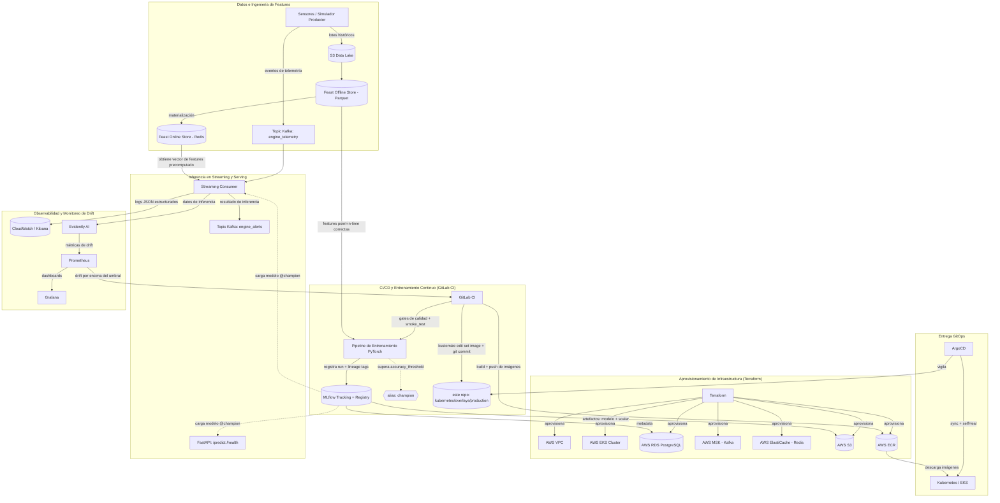

# Predictive Maintenance MLOps

**Plataforma MLOps end-to-end para clasificación en tiempo real de Vida Útil Remanente (RUL) en motores turbofan**

*Read this in other languages: [English](README.md)*

[](LICENSE)
[](api/pyproject.toml)
[](core_ml/src/train.py)
[](core_ml/src/train.py)
[](docker-compose.yml)
[](kubernetes/base)
[](terraform)
[](.gitlab-ci.yml)
[](https://github.com/psf/black)

---

## Índice

1. [Resumen Ejecutivo](#resumen-ejecutivo)
2. [Arquitectura del Sistema](#arquitectura-del-sistema)
3. [Stack Tecnológico](#stack-tecnológico)
4. [El Pipeline de MLOps](#el-pipeline-de-mlops)
5. [Monitoreo y Observabilidad](#monitoreo-y-observabilidad)
6. [Decisiones Arquitectónicas y Trade-offs](#decisiones-arquitectónicas-y-trade-offs)
7. [Referencia de la API](#referencia-de-la-api)
8. [Estructura del Repositorio](#estructura-del-repositorio)
9. [Primeros Pasos](#primeros-pasos)
10. [Gates de Calidad y Seguridad](#gates-de-calidad-y-seguridad)
11. [Posibles Extensiones](#posibles-extensiones)
12. [Licencia](#licencia)

---

## Resumen

**El problema.** En entornos industriales, el fallo inesperado de un equipo provoca graves pérdidas operativas, riesgos de seguridad y costes de mantenimiento no planificados. Predecir *cuándo* una máquina está a punto de fallar es un problema de modelado ampliamente estudiado; el problema mucho más difícil, y mucho más valioso, es operacionalizar esa predicción — procesar telemetría de sensores de alto rendimiento de forma continua, garantizar que exactamente las mismas transformaciones de features se aplican en entrenamiento y en inferencia, y permitir que el sistema detecte su propia degradación y se reentrene sin intervención manual.

**La solución.** Este proyecto implementa una plataforma MLOps de nivel productivo que predice la degradación de motores turbofan (dataset C-MAPSS de la NASA) en tiempo real. La estimación de la Vida Útil Remanente (RUL) se formula como un problema de clasificación de tres clases — **Healthy** (saludable), **Alert** (alerta), **Critical** (crítico) — servido por una Red Convolucional Totalmente Convolucional (FCN) entrenada en PyTorch. Alrededor de ese modelo se encuentra la parte que realmente lo hace operable en producción: un Feature Store que elimina el training/serving skew, un Model Registry que bloquea cada despliegue tras un umbral de precisión medible, un pipeline de streaming que convierte mensajes crudos de Kafka en predicciones con reintentos acotados y un circuit breaker, y una ruta de entrega GitOps donde el cluster nunca puede divergir silenciosamente de lo que fue revisado y mergeado.

**El valor.** Cada decisión arquitectónica de este repositorio optimiza para el mismo resultado: **fallos detectados localmente, de forma barata y temprana — antes de que lleguen a un cliente, a una factura de GPU o a un cluster de producción.** Concretamente: una violación de un contrato de datos se rechaza antes de que arranque siquiera un entrenamiento, en vez de aparecer como un modelo corrupto tres etapas después; un bug que rompería el pipeline se detecta en segundos contra un dataset toy fijo en vez de después de una corrida de varias horas contra el dataset completo; un manifiesto de Kubernetes incorrecto es un `kustomize edit` que se aplica limpiamente o falla de forma explícita, nunca un `sed` que silenciosamente no hace nada; un `kubectl apply` manual contra un cluster en vivo es estructuralmente imposible, porque el propio pipeline ya no posee credenciales del cluster — solo ArgoCD las tiene, y reconcilia continuamente el cluster para que coincida con Git. El resultado es un sistema en el que un ingeniero nuevo puede confiar en que "pasó CI" realmente significa algo, y en el que un modelo solo llega a los clientes que dependen de él si ha demostrado su valía frente a un estándar de calidad explícito y auditable.

---

## Arquitectura del Sistema

La arquitectura es dirigida por eventos (event-driven), nativa de la nube, y desacopla deliberadamente cada etapa del ciclo de vida de ML para que cada una pueda fallar, escalar y probarse de forma independiente.



### Flujo de Datos, en Palabras

1. **Ingesta.** La telemetría de sensores llega ya sea como un stream continuo (topic de Kafka `engine_telemetry`) o como lotes históricos depositados en el data lake de S3.
2. **Ingeniería de features.** Los datos históricos se transforman en ventanas deslizantes de tamaño fijo (30 timesteps x 14 sensores) y se escriben en el **Feast Offline Store** (S3/Parquet), que garantiza corrección point-in-time — ningún dato futuro se filtra jamás dentro de una ventana de entrenamiento. Esas mismas definiciones de features se materializan en el **Feast Online Store** (Redis) para consultas de baja latencia en el momento de la inferencia. Entrenamiento y serving leen de las mismas definiciones de features, por construcción: el training/serving skew no es algo de lo que este sistema deba cuidarse, es algo que la arquitectura hace estructuralmente imposible.
3. **Entrenamiento.** GitLab CI extrae features históricas point-in-time-correct del offline store de Feast, entrena la FCN en PyTorch, y registra la corrida en MLflow — pesos del modelo, el `StandardScaler` ajustado, hiperparámetros, y una tupla de reproducibilidad completa (commit SHA de Git, hash de datos de DVC, run ID de MLflow, tag de imagen de contenedor).
4. **Quality gate.** Un modelo entrenado se evalúa sobre un split de validación separado. Solo si supera `monitoring.accuracy_threshold` (`config/config.yaml`) su versión de MLflow se promueve al alias `champion`. Todo lo que no supera el umbral queda registrado, para auditoría, pero nunca se sirve.
5. **Entrega.** GitLab CI construye y publica las imágenes de contenedor en ECR, y luego actualiza el tag de imagen declarado en `kubernetes/overlays/production` y hace commit de ese cambio a Git. Nunca toca el cluster directamente.
6. **Reconciliación.** ArgoCD, corriendo dentro del cluster, vigila esa ruta en Git y reconcilia continuamente el estado real del cluster para que coincida (`selfHeal: true`) — cualquier `kubectl edit` fuera de banda se revierte automáticamente.
7. **Inferencia.** El streaming consumer recoge un evento de telemetría, obtiene el vector de features precomputado correspondiente del online store de Feast (Redis), ejecuta la inferencia con el modelo con alias `champion`, y publica la clasificación (`Healthy` / `Alert` / `Critical`) en el topic de Kafka `engine_alerts`. El servicio FastAPI expone el mismo modelo `champion` de forma síncrona vía `/predict`, para scoring bajo demanda.
8. **Observabilidad.** Cada inferencia que sirve el consumer se registra como JSON estructurado y se evalúa de forma asíncrona con Evidently AI contra una distribución de referencia. Prometheus recolecta las métricas de drift resultantes; Grafana las visualiza; y si el drift cruza un umbral configurado, un trigger automático dispara el pipeline de reentrenamiento en GitLab CI — cerrando el ciclo sin que un humano tenga que darse cuenta de que el modelo quedó desactualizado.

---

## Stack Tecnológico

| Categoría | Herramientas | Propósito en este proyecto |
| --- | --- | --- |
| **Machine Learning** | PyTorch, Fully Convolutional Network (FCN) | Clasificación multiclase de RUL (Healthy / Alert / Critical) a partir de ventanas de sensores |
| **Tracking y Model Registry** | MLflow | Tracking de experimentos, almacenamiento de artefactos, y la *única* fuente de verdad sobre qué versión de modelo es servible (alias `champion`) |
| **Feature Store** | Feast, Redis, Apache Parquet | Features de entrenamiento offline point-in-time-correct + serving de features online de baja latencia, eliminando el training/serving skew |
| **Versionado de Datos y Contratos** | DVC (remoto S3), Pandera, Pydantic | Versionado reproducible de datasets; validación de esquema fail-fast en cada etapa del pipeline |
| **Streaming de Datos** | Apache Kafka (Amazon MSK en producción) | Transporte desacoplado y duradero para la ingesta de telemetría y la publicación de alertas |
| **Serving de la API** | FastAPI, Uvicorn | Endpoint de inferencia síncrono, auto-documentado y validado por tipos |
| **Contenerización y Orquestación** | Docker, Docker Compose, Kubernetes (Amazon EKS), Kustomize | Paridad local con producción; manifiestos declarativos por capas de entorno |
| **GitOps y Entrega** | ArgoCD, External Secrets Operator | Reconciliación de cluster pull-based y autocurativa; secretos sincronizados desde AWS Secrets Manager, nunca commiteados |
| **Infraestructura como Código** | Terraform | Aprovisionamiento declarativo y reproducible de todo el footprint de AWS |
| **Infraestructura Cloud** | AWS VPC, EKS, RDS (PostgreSQL), MSK, ElastiCache (Redis), S3, ECR, Secrets Manager, IAM (federación OIDC, IRSA) | Infraestructura gestionada, privada por defecto, sin credenciales estáticas de larga duración |
| **Pruebas de Integración Local** | Testcontainers, LocalStack | Contenedores reales y efímeros de Postgres/Kafka/S3/SQS/Secrets Manager que prueban integración real, a coste cero |
| **Monitoreo y Observabilidad** | Evidently AI, Prometheus, Grafana, structlog, tenacity, pybreaker | Detección de data/concept drift, métricas, logs estructurados en JSON, reintentos acotados, circuit breaking |
| **CI/CD** | GitLab CI/CD, AWS OIDC, gitlab-ci-local, GitLab Runner self-hosted | Gates de calidad, smoke testing, entrenamiento, construcción de imágenes y releases GitOps — ejecutables de forma idéntica fuera de GitLab, y en hardware local sin gastar minutos de shared runner |
| **Entorno de Desarrollo** | Poetry, DevContainers, VS Code, Make | Entornos locales deterministas y reproducibles; una única interfaz de comandos compartida con CI |
| **Calidad de Código y Seguridad** | Ruff, Black, isort, mypy, pytest, Bandit, Trivy, yamllint, pre-commit | Gates de calidad shift-left, aplicados de forma idéntica en pre-commit y en CI |

---

## El Pipeline de MLOps

### Data Pipeline

Cada etapa del pipeline de datos valida su propia salida contra un esquema explícito **antes** de que se permita ejecutar la siguiente etapa, más costosa (ver `core_ml/src/data_contracts.py` para los contratos Pandera de telemetría cruda, telemetría etiquetada y features en ventana; `api/schemas.py` para el contrato Pydantic de los requests de inferencia; `api/config_schema.py` / `core_ml/src/config_schema.py` para la validación de configuración). Un dataset malformado, una lectura de sensor `NaN`, un valor de configuración fuera de rango, o un request de inferencia con forma incorrecta se rechazan de inmediato — nunca se les permite llegar a un forward-pass del modelo y fallar de una forma más confusa y costosa más adelante.

Un **dataset toy** fijo y determinista de ~1.000 filas (`core_ml/data_toy/`, regenerado de forma reproducible por `core_ml/scripts/build_toy_dataset.py`, versionado con DVC) permite que todo el pipeline — contratos, preparación de features, entrenamiento, registro en MLflow, quality gate, promoción en el registry — corra de extremo a extremo en segundos en una laptop, sin GPU y sin dependencia de Feast/S3/Redis. Esto es lo que ejecuta `make smoke-test`, y GitLab CI exige que pase *antes* de que se permita siquiera arrancar la etapa `train` real contra el dataset completo.

### Training Pipeline

El entrenamiento se dispara con un merge a la rama principal o con una alerta automática de drift. El job `train_model` extrae features históricas point-in-time-correct del offline store de Feast, entrena la FCN, y etiqueta la corrida de MLflow resultante con una tupla de reproducibilidad completa: **commit SHA de Git + hash de datos de DVC + hiperparámetros + run ID de MLflow + tag de imagen de contenedor** (`_build_lineage_tags` en `core_ml/src/train.py`). Dada cualquier versión de modelo alguna vez desplegada, las cinco coordenadas se pueden recuperar — no hay arqueología de "qué commit produjo este modelo".

No existe ningún `model.pkl` ni `scaler.joblib` suelto en un directorio en ningún punto de este sistema. `train.py` registra el modelo de PyTorch **y** el `StandardScaler` ajustado como artefactos de la misma corrida de MLflow, y registra la versión del modelo en el MLflow Model Registry. Una versión solo se promueve al alias `champion` — el que tanto `api/main.py` como el streaming consumer realmente cargan (`models:/<name>@champion`) — si supera el quality gate; de lo contrario, queda registrada para auditoría pero nunca llega a servir tráfico.

### Deployment Pipeline (CI/CD)

```
push / merge a main
      │
      ▼
 quality        →  make ci (formato, lint, tipos, tests unitarios, SAST, escaneo de secretos/CVEs/IaC, YAML lint)
      │
      ▼
 smoke_test     →  se prueba toda la mecánica del pipeline contra el dataset toy, en segundos
      │
      ▼
 data_pull      →  dvc pull (dataset C-MAPSS completo)
      │
      ▼
 train          →  entrenamiento contra el dataset completo vía Feast; promoción a `champion` sujeta al quality gate
      │
      ▼
 build_image    →  construye y publica en ECR tanto la imagen de la API como la del streaming-consumer
      │
      ▼
 release        →  kustomize edit set image + git commit/push (NO es un despliegue al cluster)
      │
      ▼
 ArgoCD         →  detecta el commit, reconcilia el cluster (sync + selfHeal)
```

La etapa `release` es, deliberadamente, la etapa menos poderosa del pipeline: nunca se autentica contra EKS, nunca ejecuta `kubectl`, y no puede alcanzar el cluster ni siquiera si estuviera comprometida. Edita un único campo YAML a través de la propia API de Kustomize y publica un commit. Todo lo que ocurre después de ese commit es responsabilidad de ArgoCD, que corre dentro del cluster que gestiona.

---

## Monitoreo y Observabilidad

- **Detección de drift.** Cada inferencia que sirve el streaming consumer se evalúa de forma asíncrona con **Evidently AI** contra una distribución de referencia, vigilando tanto data drift (cambio en la distribución de entrada) como concept drift (degradación de la relación entre las entradas y la etiqueta correcta).
- **Métricas y dashboards.** Las métricas de drift y de servicio se exponen vía `prometheus-client`, son recolectadas por **Prometheus**, y se visualizan en **Grafana** — el mismo stack que se usa para vigilar la latencia y el throughput de la capa de serving.
- **Reentrenamiento automatizado.** Si el drift cruza `monitoring.drift_threshold` (`config/config.yaml`), un trigger automático llega a GitLab CI, que vuelve a ejecutar el pipeline de entrenamiento contra los datos etiquetados más recientes del offline feature store. Un modelo reentrenado igualmente tiene que superar el quality gate antes de poder reemplazar al `champion` actual.
- **Logs estructurados.** `core_ml/src/logging_config.py` (replicado en `api/`) configura `structlog` para emitir un objeto JSON por línea de log — `timestamp` / `level` / `logger` / `event` más contexto arbitrario — incluyendo loggers de librerías de terceros (uvicorn, botocore). Directamente consultable en CloudWatch Logs Insights o Kibana; sin necesidad de parsear texto.
- **Resiliencia ante fallos parciales.** El streaming consumer envuelve las llamadas a dependencias transitorias (Feast, red) en un backoff exponencial acotado (`tenacity`, `stop_after_attempt(3)`) y envuelve el camino de inferencia por mensaje en un circuit breaker real (`pybreaker`, `fail_max=5`, `reset_timeout=60s`). Una dependencia caída degrada a fallos rápidos en vez de una tormenta de reintentos sin límite; un único mensaje malformado se captura, se registra con contexto completo, y el consumer continúa — ya no puede tumbar el proceso.

---

## Decisiones Arquitectónicas y Trade-offs

Cada decisión no obvia que sigue fue tomada deliberadamente, frente a una alternativa concreta — no por defecto ni por moda.

**FastAPI en lugar de Flask.** La capa de serving necesitaba soporte async nativo (para la carga de modelos/artefactos, que es I/O-bound, y para un futuro manejo concurrente de requests), documentación OpenAPI automática para un servicio contra el que otros ingenieros integrarían, e integración de primera clase con Pydantic para que el contrato de request de inferencia (`api/schemas.py`) se valide en el borde del framework en vez de con checks escritos a mano dispersos por el handler.

**Un Feature Store con dos almacenes físicamente distintos, no uno solo.** El entrenamiento necesita ventanas históricas point-in-time-correct sobre lotes de datos potencialmente enormes; la inferencia necesita un único vector de features en milisegundos de un solo dígito. Intentar servir ambas necesidades desde un único almacén implica comprometer una de las dos. La separación offline (Parquet/S3) + online (Redis) de Feast permite optimizar cada lado para lo que realmente hace, garantizando a la vez que ambos lean las mismas *definiciones* de features — que es el mecanismo real que elimina el training/serving skew, no una política ni un checklist de code review.

**GitOps (ArgoCD, pull-based) en lugar de que CI despliegue directamente al cluster.** La versión anterior de este pipeline hacía que GitLab CI ejecutara `kubectl apply` y `kubectl rollout restart` directamente. Eso significa que un job de CI comprometido, o un script con un error, tiene credenciales permanentes para mutar un cluster en vivo. Migrar a ArgoCD reduce el radio de impacto de CI a "puede publicar imágenes de contenedor y editar un archivo YAML en este repo" — nunca llega a poseer credenciales del cluster. `selfHeal: true` es la otra mitad del trade-off: un `kubectl edit` de emergencia en producción ahora se revierte silenciosamente por diseño, que es exactamente la propiedad deseable una vez que la fuente de verdad es Git y no el conocimiento tribal de quién cambió qué a mano.

**Kustomize en lugar de `sed` sobre YAML commiteado.** Una iteración anterior parcheaba los tags de imagen en los manifiestos con `sed -i`, que silenciosamente no hace nada en el momento en que alguien reindenta una línea o renombra un campo — un falso negativo que falla en el peor momento posible. `kustomize edit set image` es una edición estructural a través de la propia API de la herramienta: o tiene éxito, o falla de forma explícita. La separación base/overlay también significa que añadir un segundo entorno es un nuevo directorio de overlay, no una copia bifurcada de cada manifiesto.

**MLflow como único Model Registry, con un umbral de precisión explícito como gate.** Ningún script de este repositorio copia un archivo de modelo a una ubicación de serving. El único camino a producción es: entrenar, registrar en MLflow, superar `monitoring.accuracy_threshold` en un split separado, ser promovido al alias `champion`. Esto elimina toda una clase de incidentes en los que "alguien empujó un modelo a mano" se salta la validación que se suponía que el pipeline debía imponer.

**Un dataset toy y una etapa de smoke-test obligatoria, antes del entrenamiento real.** El mismo principio "shift-left" que normalmente se aplica al código (detectar un bug en un test unitario, no en staging) se aplica también a los pipelines de ML. `make smoke-test` ejercita *todo* el mecanismo — contratos, registro en MLflow, quality gate, promoción en el registry — contra un dataset fijo de ~1.000 filas en segundos. GitLab CI exige que esto pase antes de que se permita siquiera arrancar la etapa `train`, que lee el dataset completo vía Feast y puede tardar horas.

**Testcontainers + LocalStack en lugar de mockear sistemas externos en las pruebas de integración.** Un test que mockea Postgres, Kafka o S3 puede pasar mientras la integración real está rota — el mock y el sistema real divergen silenciosamente. Testcontainers levanta contenedores reales y efímeros desde el propio pytest; LocalStack hace lo mismo para AWS (S3, SQS, Secrets Manager) a coste cero y sin credenciales. Son más lentos que los tests mockeados, por lo que se excluyen del `make test`/pre-commit por defecto y se ejecutan explícitamente vía `make test-integration` — un trade-off deliberado de velocidad por confianza, aplicado solo donde la integración realmente importa.

**Reintentos estructurados y un circuit breaker en el streaming consumer, no un simple bucle `while True`.** Un consumer ingenuo que reintenta para siempre ante cada fallo, o bien machaca una dependencia caída hasta el suelo, o bien descarta mensajes silenciosamente cuando entra en pánico y termina. El backoff exponencial acotado más un circuit breaker (fallar rápido una vez que una dependencia está claramente caída, recuperarse automáticamente cuando vuelve) es la forma estándar de un consumer de producción que tiene que mantenerse en pie sin supervisión.

---

## Referencia de la API

El servicio FastAPI carga el modelo con alias `champion` y su `StandardScaler` desde el MLflow Model Registry al arrancar. Si aún no se ha promovido ningún modelo, el servicio arranca igualmente, pero reporta que no está listo.

| Endpoint | Método | Descripción | Respuesta |
| --- | --- | --- | --- |
| `/health` | `GET` | Probe de liveness/readiness | `200` con `{"status": "ok", "service": "online", "model_version": "<n>"}` si hay un modelo champion cargado; `503` si no |
| `/predict` | `POST` | Puntúa una ventana de sensores contra el modelo champion | `{"engine_id": "...", "prediction": "Healthy" \| "Alert" \| "Critical", "model_version": "<n>"}` |

La forma del body del request para `/predict` (un array de lecturas de sensores `window_size x num_features`) se genera en tiempo de ejecución a partir de `config/config.yaml`, y se valida con el contrato Pydantic de `api/schemas.py` antes de llegar siquiera al modelo.

---

## Estructura del Repositorio

```text
.
├── .devcontainer/              # Definición inmutable del entorno de desarrollo
├── api/                        # Microservicio de serving FastAPI (pyproject.toml/poetry.lock propio)
│   ├── schemas.py               # Contrato de datos Pydantic para /predict (fail fast)
│   ├── config_schema.py         # Contrato de datos Pydantic para config.yaml
│   └── tests/                  # Tests unitarios + de integración (Testcontainers)
├── core_ml/                    # Pipeline de datos, feature store, entrenamiento y streaming (proyecto Poetry propio)
│   ├── src/                    # Procesamiento de datos, carga de config, entrenamiento PyTorch
│   │   ├── data_contracts.py    # Contratos de datos Pandera (fail fast) del pipeline de datos
│   │   ├── logging_config.py    # Logging JSON estructurado con structlog
│   │   └── train.py             # Entrenamiento + lineage tags + quality gate + promoción en el registry
│   ├── scripts/                 # build_toy_dataset.py: regenera el dataset toy versionado con DVC
│   ├── data_toy/                 # Dataset toy (versionado con DVC, gitignored; ver data_toy.dvc)
│   ├── streaming/               # kafka_consumer.py: reintentos + circuit breaker + logs estructurados
│   ├── feature_store/          # Definiciones de entidad y feature view de Feast
│   ├── tests/                  # Tests unitarios + de integración (Testcontainers)
│   └── Dockerfile                # Imagen del streaming-consumer (repo ECR propio)
├── config/                     # Parámetros globales de configuración
├── kubernetes/
│   ├── base/                    # Base de Kustomize: todos los manifiestos + ExternalSecret + configMapGenerator
│   └── overlays/production/     # Tags de imagen (kustomize edit set image, nunca sed)
├── gitops/argocd/               # Application de ArgoCD: vigila kubernetes/overlays/production
├── localstack/                  # Bootstrap de LocalStack (init-aws.sh)
├── monitoring/                 # Código del servicio de Evidently AI
├── terraform/                  # Infraestructura AWS (VPC, EKS, RDS, MSK, ElastiCache, S3, ECR, IAM/OIDC)
│   └── bootstrap/                # Único uso: S3 + DynamoDB para el backend de estado de Terraform
├── .gitlab-ci.yml              # CI/CD: quality -> smoke_test -> data_pull -> train -> build -> release
├── .pre-commit-config.yaml     # Git hooks locales: lint, formato, tipado, tests, secretos, YAML
├── Makefile                    # Interfaz única de ejecución, idéntica en local y en CI
├── docker-compose.yml          # Stack local: Postgres, Kafka, Redis, MLflow, API, LocalStack
└── Dockerfile                  # Imagen de contenedor del servicio de la API
```

---

## Primeros Pasos

### 1. Prerrequisitos

Python 3.12, Poetry 2.4.1, Docker (con Compose v2), `make`, y `pre-commit`. Ver el [`Makefile`](Makefile) para la lista completa de herramientas locales (Trivy, kustomize, Terraform y kubectl solo se necesitan más allá de la etapa de desarrollo local).

### 2. Configurar el entorno de desarrollo

Abrir el repositorio en VS Code y seleccionar **Reopen in Container** — esto provisiona Python, la versión anclada de Poetry, `make` y el toolchain de IaC, instala las dependencias de ambos paquetes, y habilita los hooks de pre-commit automáticamente.

Fuera de un DevContainer:

```bash
pip install "poetry==2.4.1" pre-commit
make install                             # instala api/ y core_ml/ (con dependencias de dev)
make precommit-install                   # habilita los git hooks
```

### 3. Ejecutar los comandos de calidad del día a día

```bash
make format        # autocorrige formato + orden de imports
make lint           # ruff
make typecheck       # mypy
make test           # pytest (api/ y core_ml/)
make security        # bandit + trivy
make ci             # todo lo anterior, exactamente como corre en GitLab CI
```

### 4. Validar el pipeline antes de gastar cómputo real

```bash
make dvc-pull        # descarga data/ y data_toy/ desde el remoto S3 de DVC
make smoke-test       # contratos de datos + entrenamiento + MLflow + quality gate, sobre el dataset toy, en segundos
```

### 5. Levantar el stack local completo

```bash
make compose-up     # Postgres, Kafka, Redis, MLflow, la API, y LocalStack
make compose-ps     # verifica el healthcheck de cada servicio
```

`/health` en la API reporta `503` hasta que un modelo haya sido promovido a `champion` en este MLflow local:

```bash
export MLFLOW_TRACKING_URI=http://localhost:5000
make train-toy
docker compose restart api
```

### 6. Ejecutar la suite de pruebas de integración (contenedores reales efímeros)

```bash
make test-integration   # requiere Docker; Testcontainers levanta Postgres/Kafka/LocalStack reales
```

### 7. Publicar una nueva versión (GitOps) y validar la infraestructura localmente

```bash
make docker-build              # construye las imágenes de api + streaming-consumer
make k8s-build                 # renderiza kubernetes/overlays/production para inspección
make gitops-release            # commitea el nuevo tag de imagen; ArgoCD lo recoge desde ahí

make terraform-fmt             # terraform fmt -check (nunca plan/apply desde aquí)
make ci-local                  # corre .gitlab-ci.yml localmente vía gitlab-ci-local
```

### 8. Correr todo el pipeline de CI/CD en tu propio hardware (cero minutos de GitLab)

Dos capas complementarias, ambas manejadas desde el Makefile, permiten que cada job de [`.gitlab-ci.yml`](.gitlab-ci.yml) corra en hardware local en vez de en la flota de shared runners de gitlab.com:

- **`gitlab-ci-local`** (ya integrado vía `make ci-local`) parsea `.gitlab-ci.yml` y ejecuta cualquier job — o el pipeline completo — en contenedores Docker de esta máquina, para iterar rápido y sin fricción mientras escribes un job. No involucra cuenta de GitLab ni ida y vuelta por red.
  ```bash
  make ci-local JOB=quality       # un job puntual
  make ci-local                    # el pipeline completo
  ```
  > **Windows/Git Bash:** `make ci-local` ya fija `MSYS_NO_PATHCONV=1` por vos — sin esa variable, Git Bash reescribe el `--workdir` Linux del contenedor (p.ej. `/builds/...`) a una ruta Windows inválida y todos los jobs fallan de inmediato con `the working directory ... is invalid`. Si alguna vez invocás `gitlab-ci-local` directamente (sin pasar por `make`), fijá vos mismo esa variable.

- **Un GitLab Runner self-hosted** (`runner/docker-compose.yml`) es lo que reemplaza de verdad a los shared runners para los pipelines que se disparan con un push real. Se registra contra este proyecto en gitlab.com, toma cualquier job con el tag `local-hardware` (el [`default.tags`](.gitlab-ci.yml) que heredan todos los jobs) y lo ejecuta contra tu propio daemon Docker — el trust OIDC de AWS (`terraform/iam.tf`) está limitado por `project_path`, no por runner específico, así que funciona sin modificaciones.
  ```bash
  # Una sola vez: crear un runner en gitlab.com -> Settings > CI/CD > Runners ->
  # "New project runner" (tag: local-hardware), copiar su token glrt-..., y:
  make runner-register TOKEN=glrt-xxxxxxxxxxxx
  make runner-up          # lo levanta, restart: unless-stopped
  make runner-status      # confirma que quedó registrado e inactivo
  git push                # gitlab.com encola el job; tu máquina lo ejecuta
  ```
  `make runner-down` lo detiene sin perder el registro; `make runner-unregister` lo da de baja en GitLab y borra el volumen de configuración local. La config/token del runner viven solo en el volumen Docker `gitlab-runner-config`: nada se escribe en el repo.

Flujo diario: iterar con `make ci-local` (o los targets individuales `make lint`/`make test`/`make smoke-test`) hasta que quede en verde, `git push`, y el runner self-hosted reproduce exactamente el mismo pipeline — sin gastar minutos de shared runner y sin sorpresas entre local y CI.

Desplegar el entorno completo de AWS/Kubernetes desde cero (terraform apply, bootstrap de EKS, ArgoCD, variables de CI/CD de GitLab) es un proceso considerablemente más largo, que implica costes reales de nube y configuración específica de la cuenta; queda deliberadamente fuera del alcance de esta guía rápida.

---

## Gates de Calidad y Seguridad

Cada verificación de abajo corre localmente como un git hook de `pre-commit`, usando exactamente los mismos comandos que CI. Un commit se rechaza automáticamente si alguno falla.

| Aspecto | Herramienta | Aplicado por |
| --- | --- | --- |
| Lint | [Ruff](https://docs.astral.sh/ruff/) | `make lint` |
| Formato | [Black](https://black.readthedocs.io/) + [isort](https://pycqa.github.io/isort/) | `make format-check` |
| Tipado estático | [mypy](https://mypy-lang.org/) | `make typecheck` |
| Tests unitarios | [pytest](https://docs.pytest.org/) | `make test` |
| SAST de Python | [Bandit](https://bandit.readthedocs.io/) | `make security` |
| Secretos / CVEs de dependencias / misconfiguración de IaC | [Trivy](https://aquasecurity.github.io/trivy/) | `make security` |
| Validez y estilo de YAML | [yamllint](https://yamllint.readthedocs.io/) | `make yamllint` |

`make ci` ejecuta el conjunto completo, de forma idéntica a la etapa `quality` de `.gitlab-ci.yml` — un `make ci` en verde localmente es un fuerte predictor de un pipeline de CI en verde.

---

## Posibles Extensiones

Áreas dejadas deliberadamente fuera de alcance, listadas aquí en vez de simplemente ignoradas:

- **Despliegues canary / shadow.** La promoción del modelo al alias `champion` es actualmente todo-o-nada; una etapa canary o de tráfico shadow entre la promoción y el rollout completo detectaría regresiones que el quality gate offline no puede ver.
- **Explicabilidad del modelo.** Añadir atribuciones SHAP o de gradientes integrados a `/predict` permitiría a un ingeniero de mantenimiento ver *qué* sensores impulsaron una clasificación `Critical`, no solo la clasificación en sí.
- **Pruebas de carga de la ruta de serving.** No existe todavía un benchmark formal de latencia/throughput para `/predict` ni para el streaming consumer bajo carga sostenida; esto informaría el dimensionamiento del node group de EKS y del número de brokers de MSK.
- **Multi-región / disaster recovery.** El footprint actual de Terraform apunta a una única región de AWS; la replicación cross-region de RDS/MSK y un runbook documentado de failover aún no están implementados.

---

## Licencia

Distribuido bajo la Licencia MIT. Ver [`LICENSE`](LICENSE) para el texto completo.

---

**Autor:** Armando Guarnera — [github.com/arguar13](https://github.com/arguar13)
