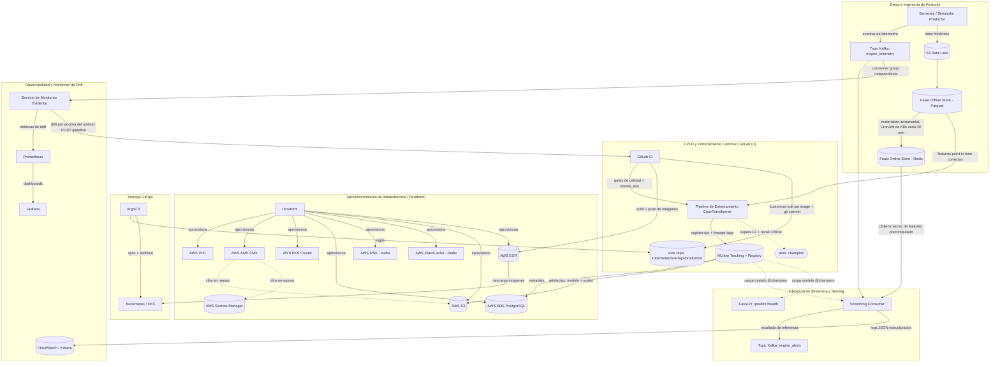

# Predictive Maintenance MLOps

**Plataforma MLOps end-to-end para clasificación en tiempo real de Vida Útil Remanente (RUL) en motores turbofan**

*Read this in other languages: [English](README.md)*

[](LICENSE)
[](api/pyproject.toml)
[](core_ml/src/train.py)
[](core_ml/src/train.py)
[](docker-compose.yml)
[](kubernetes/base)
[](terraform)
[](.gitlab-ci.yml)
[](https://github.com/psf/black)

---

## Índice

1. [Resumen Ejecutivo](#resumen-ejecutivo)
2. [Arquitectura del Sistema](#arquitectura-del-sistema)
3. [Stack Tecnológico](#stack-tecnológico)
4. [El Pipeline de MLOps](#el-pipeline-de-mlops)
5. [Monitoreo y Observabilidad](#monitoreo-y-observabilidad)
6. [Decisiones Arquitectónicas y Trade-offs](#decisiones-arquitectónicas-y-trade-offs)
7. [Referencia de la API](#referencia-de-la-api)
8. [Estructura del Repositorio](#estructura-del-repositorio)
9. [Primeros Pasos](#primeros-pasos)
10. [Gates de Calidad y Seguridad](#gates-de-calidad-y-seguridad)
11. [Posibles Extensiones](#posibles-extensiones)
12. [Licencia](#licencia)

---

## Resumen Ejecutivo

**El problema.** En entornos industriales, el fallo inesperado de un equipo provoca graves pérdidas operativas, riesgos de seguridad y costes de mantenimiento no planificados. Predecir *cuándo* una máquina está a punto de fallar es un problema de modelado ampliamente estudiado; el problema mucho más difícil, y mucho más valioso, es operacionalizar esa predicción — procesar telemetría de sensores de alto rendimiento de forma continua, garantizar que exactamente las mismas transformaciones de features se aplican en entrenamiento y en inferencia, y permitir que el sistema detecte su propia degradación y se reentrene sin intervención manual.

**La solución.** Este proyecto implementa una plataforma MLOps de nivel productivo que predice la degradación de motores turbofan (dataset C-MAPSS de la NASA) en tiempo real. La estimación de la Vida Útil Remanente (RUL) se formula como un problema de clasificación de tres clases — **Healthy** (saludable), **Alert** (alerta), **Critical** (crítico) — servido por un **ConvTransformer** (una etapa Conv1d que alimenta un encoder Transformer) entrenado en PyTorch, elegido frente a cuatro alternativas en un benchmark propio. Alrededor de ese modelo se encuentra la parte que realmente lo hace operable en producción: un Feature Store que elimina el training/serving skew, un Model Registry que bloquea cada despliegue tras un umbral de precisión medible, un pipeline de streaming que convierte mensajes crudos de Kafka en predicciones con reintentos acotados y un circuit breaker, y una ruta de entrega GitOps donde el cluster nunca puede divergir silenciosamente de lo que fue revisado y mergeado.

**El valor.** Cada decisión arquitectónica de este repositorio optimiza para el mismo resultado: **fallos detectados localmente, de forma barata y temprana — antes de que lleguen a un cliente, a una factura de GPU o a un cluster de producción.** Concretamente: una violación de un contrato de datos se rechaza antes de que arranque siquiera un entrenamiento, en vez de aparecer como un modelo corrupto tres etapas después; un bug que rompería el pipeline se detecta en segundos contra un dataset toy fijo en vez de después de una corrida de varias horas contra el dataset completo; un manifiesto de Kubernetes incorrecto es un `kustomize edit` que se aplica limpiamente o falla de forma explícita, nunca un `sed` que silenciosamente no hace nada; un `kubectl apply` manual contra un cluster en vivo es estructuralmente imposible, porque el propio pipeline ya no posee credenciales del cluster — solo ArgoCD las tiene, y reconcilia continuamente el cluster para que coincida con Git. El resultado es un sistema en el que un ingeniero nuevo puede confiar en que "pasó CI" realmente significa algo, y en el que un modelo solo llega a los clientes que dependen de él si ha demostrado su valía frente a un estándar de calidad explícito y auditable.

---

## Arquitectura del Sistema

La arquitectura es dirigida por eventos (event-driven), nativa de la nube, y desacopla deliberadamente cada etapa del ciclo de vida de ML para que cada una pueda fallar, escalar y probarse de forma independiente.



### Flujo de Datos, en Palabras

1. **Ingesta.** La telemetría de sensores llega ya sea como un stream continuo (topic de Kafka `engine_telemetry`) o como lotes históricos depositados en el data lake de S3.
2. **Ingeniería de features.** Los datos históricos se transforman en ventanas deslizantes de tamaño fijo (30 timesteps x 24 features — ver la nota sobre la forma de la ventana más abajo) y se escriben en el **Feast Offline Store** (S3/Parquet), que garantiza corrección point-in-time — ningún dato futuro se filtra jamás dentro de una ventana de entrenamiento. Esas mismas definiciones de features se materializan en el **Feast Online Store** (Redis) para consultas de baja latencia en el momento de la inferencia. `train_model` solo ejecuta `feast apply`, que registra el *esquema* de entidades/feature views — nunca toca el online store. Un `CronJob` dedicado de Kubernetes (`kubernetes/base/feast-materialize-cronjob.yaml`) ejecuta `feast materialize-incremental` cada 30 minutos, dentro del cluster, porque ElastiCache vive en subnets privadas a las que el runner de CI no tiene acceso. Entrenamiento y serving leen de las mismas definiciones de features, por construcción: el training/serving skew no es algo de lo que este sistema deba cuidarse, es algo que la arquitectura hace estructuralmente imposible.
3. **Entrenamiento.** El job `train_model` reconstruye el parquet de features (`prepare_feast_data.py`), lo sube a la ruta de S3 que declara `feature_store/features.py`, ejecuta `feast apply` para registrar el esquema en el registry de Feast (también en S3), y recién entonces extrae las features históricas point-in-time-correct del offline store, entrena el ConvTransformer en PyTorch (`--epochs 25 --patience 5`), y registra la corrida en MLflow — pesos del modelo, el `StandardScaler` ajustado, hiperparámetros, y una tupla de reproducibilidad completa (commit SHA de Git, hash de datos de DVC, run ID de MLflow, tag de imagen de contenedor).
4. **Quality gate.** Un modelo entrenado se evalúa sobre un split de validación separado, agrupado por *motor* (no por fila — las ventanas deslizantes del mismo motor se solapan fuertemente, y un split fila a fila filtraría casi-duplicados entre train y val). La promoción al alias `champion` exige superar *dos* umbrales independientes en `config/config.yaml`: `monitoring.f2_weighted_threshold` (F2 pondera el recall el doble que la precisión sobre las tres clases) **y** `monitoring.critical_recall_threshold` (un piso duro sobre el recall de la clase Critical específicamente — un modelo puede tener un F2 ponderado alto y aun así fallar en detectar justo la clase donde un falso negativo es más caro, y este piso es lo que atrapa ese caso). Todo lo que no supera ambos umbrales queda registrado, para auditoría, pero nunca se sirve.
5. **Entrega.** GitLab CI construye y publica las imágenes de contenedor en ECR, y luego actualiza el tag de imagen declarado en `kubernetes/overlays/production` y hace commit de ese cambio a Git. Nunca toca el cluster directamente.
6. **Reconciliación.** ArgoCD, corriendo dentro del cluster, vigila esa ruta en Git y reconcilia continuamente el estado real del cluster para que coincida (`selfHeal: true`) — cualquier `kubectl edit` fuera de banda se revierte automáticamente.
7. **Inferencia.** El streaming consumer recoge un evento de telemetría, obtiene el vector de features precomputado correspondiente del online store de Feast (Redis), ejecuta la inferencia con el modelo con alias `champion`, y publica la clasificación (`Healthy` / `Alert` / `Critical`) en el topic de Kafka `engine_alerts`. El servicio FastAPI expone el mismo modelo `champion` de forma síncrona vía `/predict`, para scoring bajo demanda.
8. **Observabilidad.** Cada inferencia que sirve el consumer se registra como JSON estructurado. De forma independiente, un **servicio de monitoreo Evidently** dedicado (`monitoring/`, su propio consumer group de Kafka sobre `engine_telemetry`) agrupa la telemetría cruda en lotes y la evalúa contra una distribución de referencia — deliberadamente desacoplado del camino caliente de inferencia, para que el cómputo de drift jamás pueda agregar latencia a `/predict` ni tumbarlo. Prometheus recolecta las métricas de drift resultantes; Grafana las visualiza; y si el drift cruza `monitoring.drift_threshold`, el propio servicio llama directamente a la API de GitLab (`POST /pipeline`, autenticado con un token sincronizado desde Secrets Manager) para disparar el pipeline de reentrenamiento — cerrando el ciclo sin que un humano tenga que darse cuenta de que el modelo quedó desactualizado.

---

## Stack Tecnológico

| Categoría | Herramientas | Propósito en este proyecto |
| --- | --- | --- |
| **Machine Learning** | PyTorch (ruedas CPU-only), ConvTransformer (Conv1d + codificación posicional sinusoidal + `TransformerEncoder`) | Clasificación multiclase de RUL (Healthy / Alert / Critical) a partir de ventanas de sensores, con early stopping sobre el mejor checkpoint de validación |
| **Tracking y Model Registry** | MLflow | Tracking de experimentos, almacenamiento de artefactos, y la *única* fuente de verdad sobre qué versión de modelo es servible (alias `champion`) |
| **Feature Store** | Feast, Redis, Apache Parquet | Features de entrenamiento offline point-in-time-correct + serving de features online de baja latencia, eliminando el training/serving skew |
| **Versionado de Datos y Contratos** | DVC (remoto S3), Pandera, Pydantic | Versionado reproducible de datasets; validación de esquema fail-fast en cada etapa del pipeline |
| **Streaming de Datos** | Apache Kafka (Amazon MSK en producción) | Transporte desacoplado y duradero para la ingesta de telemetría y la publicación de alertas |
| **Serving de la API** | FastAPI, Uvicorn | Endpoint de inferencia síncrono, auto-documentado y validado por tipos |
| **Contenerización y Orquestación** | Docker, Docker Compose, Kubernetes (Amazon EKS), Kustomize | Paridad local con producción; manifiestos declarativos por capas de entorno |
| **GitOps y Entrega** | ArgoCD, External Secrets Operator | Reconciliación de cluster pull-based y autocurativa; secretos sincronizados desde AWS Secrets Manager, nunca commiteados |
| **Infraestructura como Código** | Terraform | Aprovisionamiento declarativo y reproducible de todo el footprint de AWS |
| **Infraestructura Cloud** | AWS VPC, EKS, RDS (PostgreSQL), MSK, ElastiCache (Redis), S3, ECR, Secrets Manager, KMS (clave gestionada por el cliente), CloudWatch Logs, DynamoDB (lock del estado de Terraform), IAM (federación OIDC, IRSA) | Infraestructura gestionada, privada por defecto, sin credenciales estáticas de larga duración |
| **Pruebas de Integración Local** | Testcontainers, LocalStack | Contenedores reales y efímeros de Postgres/Kafka/S3/SQS/Secrets Manager que prueban integración real, a coste cero |
| **Monitoreo y Observabilidad** | Evidently AI (servicio independiente que consume Kafka), Prometheus, Grafana, structlog, tenacity, pybreaker | Detección de data drift desacoplada del camino de inferencia, métricas, logs estructurados en JSON, reintentos acotados, circuit breaking |
| **CI/CD** | GitLab CI/CD, AWS OIDC, gitlab-ci-local, GitLab Runner self-hosted | Gates de calidad, smoke testing, entrenamiento, construcción de imágenes y releases GitOps — ejecutables de forma idéntica fuera de GitLab, y en hardware local sin gastar minutos de shared runner |
| **Entorno de Desarrollo** | Poetry, DevContainers, VS Code, Make | Entornos locales deterministas y reproducibles; una única interfaz de comandos compartida con CI |
| **Calidad de Código y Seguridad** | Ruff, Black, isort, mypy, pytest, Bandit, Trivy, yamllint, pre-commit | Gates de calidad shift-left, aplicados de forma idéntica en pre-commit y en CI |

---

## El Pipeline de MLOps

### Data Pipeline

Cada etapa del pipeline de datos valida su propia salida contra un esquema explícito **antes** de que se permita ejecutar la siguiente etapa, más costosa (ver `core_ml/src/data_contracts.py` para los contratos Pandera de telemetría cruda, telemetría etiquetada y features en ventana; `api/schemas.py` para el contrato Pydantic de los requests de inferencia; `api/config_schema.py` / `core_ml/src/config_schema.py` para la validación de configuración). Un dataset malformado, una lectura de sensor `NaN`, un valor de configuración fuera de rango, o un request de inferencia con forma incorrecta se rechazan de inmediato — nunca se les permite llegar a un forward-pass del modelo y fallar de una forma más confusa y costosa más adelante.

**Etiquetas.** La RUL se deriva por motor como `max(ciclo) - ciclo`, y luego se agrupa en las tres clases servidas: `RUL > 60` es **Healthy**, `30 < RUL <= 60` es **Alert**, y `RUL <= 30` es **Critical** (`build_multiclass_target` en `core_ml/src/data_processing.py`).

**Una nota sobre la forma de la ventana.** `num_features` es una propiedad del *dataset*, no una constante del proyecto: `clean_and_prepare` descarta los sensores cuya varianza es prácticamente nula, calculada sobre los datos realmente cargados. El dataset toy (solo `train_FD001.txt`, una única condición operativa) produce un número distinto al de la combinación completa FD001–FD004, donde ningún sensor resulta invariante entre las seis condiciones operativas — 24 features. `config/config.yaml` declara `num_features: 24` para los componentes que lo necesitan de antemano (`producer_sim.py`, el servicio Evidently), pero `api/main.py` lo ignora deliberadamente en runtime y deduce la forma real de la signature de MLflow del modelo servido, cayendo a `scaler.n_features_in_` como respaldo. Así el contrato de `/predict` sigue a cualquier modelo que se promueva a `champion`, en vez de divergir de un valor de YAML editado a mano — un desajuste que antes hacía imposible una predicción correcta y solo se manifestaba petición a petición.

Un **dataset toy** fijo y determinista de ~1.000 filas (`core_ml/data_toy/`, regenerado de forma reproducible por `core_ml/scripts/build_toy_dataset.py`, versionado con DVC) permite que todo el pipeline — contratos, preparación de features, entrenamiento, registro en MLflow, evaluación del quality gate, promoción en el registry — corra de extremo a extremo en segundos en una laptop, sin GPU y sin dependencia de Feast/S3/Redis. Esto es lo que ejecuta `make smoke-test` (contra un tracking store SQLite efímero, y con `--no-enforce-quality-gate`: el gate igual se evalúa y se etiqueta en la corrida, pero una muestra de ~1.000 filas no es base para romper una build por calidad de modelo). GitLab CI exige que pase *antes* de que se permita siquiera arrancar la etapa `train` real contra el dataset completo.

### Training Pipeline

El entrenamiento se dispara con un merge a la rama principal o con una alerta automática de drift. El job `train_model` extrae features históricas point-in-time-correct del offline store de Feast, entrena el ConvTransformer, y etiqueta la corrida de MLflow resultante con una tupla de reproducibilidad completa: **commit SHA de Git + hash de datos de DVC + hiperparámetros + run ID de MLflow + tag de imagen de contenedor** (`_build_lineage_tags` en `core_ml/src/train.py`). Dada cualquier versión de modelo alguna vez desplegada, las cinco coordenadas se pueden recuperar — no hay arqueología de "qué commit produjo este modelo".

**El modelo.** `ConvTransformer` (`core_ml/src/train.py`) pasa una etapa `Conv1d` sobre la ventana de 30 timesteps para extraer patrones de sensores de corto alcance, agrega codificación posicional sinusoidal, y alimenta un `TransformerEncoder` de dos capas (d_model 64, 4 cabezas, dropout 0.3) que modela dependencias de largo alcance dentro de la ventana; finalmente hace global average pooling sobre el tiempo hacia una cabeza de tres clases.

**El entrenamiento es acotado, no abierto.** `--epochs 25` es un *techo*, no un objetivo: `--patience 5` corta en cuanto cinco epochs seguidos no mejoran el F2 ponderado (la misma métrica que evalúa el quality gate — elegir el checkpoint por una métrica y gatear la promoción por otra distinta dejaría que un modelo sea "el mejor" sin ser el modelo que el gate realmente exige), y siempre se restaura el mejor checkpoint — nunca el último epoch. Esto último no es una comodidad: sobre el dataset completo (mucho más solapamiento entre ventanas deslizantes que en el toy) se observó la accuracy de validación colapsando a 0.18 en el epoch 20 mientras el train loss seguía bajando, así que "entrenar más" sin restaurar el mejor checkpoint es una apuesta que puede caer justo en un pico malo. `torch.manual_seed(42)` hace las corridas reproducibles, y el propio split train/val está seedeado y agrupado por motor, de modo que el mismo commit con los mismos datos no puede superar el quality gate en una corrida del pipeline y fallar en la siguiente.

No existe ningún `model.pkl` ni `scaler.joblib` suelto en un directorio en ningún punto de este sistema. `train.py` registra el modelo de PyTorch **y** el `StandardScaler` ajustado como artefactos de la misma corrida de MLflow, y registra la versión del modelo en el MLflow Model Registry. Una versión solo se promueve al alias `champion` — el que tanto `api/main.py` como el streaming consumer realmente cargan (`models:/<name>@champion`) — si supera el quality gate; de lo contrario, queda registrada para auditoría pero nunca llega a servir tráfico.

### Deployment Pipeline (CI/CD)

```
push / merge a main
      │
      ▼
 quality        →  make ci (formato, lint, tipos, tests unitarios, SAST, escaneo de secretos/CVEs/IaC, YAML lint)
      │
      ▼
 smoke_test     →  se prueba toda la mecánica del pipeline contra el dataset toy, en segundos
      │
      ▼
 data_pull      →  dvc pull (dataset C-MAPSS completo)
      │
      ▼
 train          →  prepara features + subida a S3 + feast apply; entrena contra el dataset completo
                   vía Feast (epochs 25, patience 5); promoción a `champion` sujeta al quality gate
      │
      ▼
 build_image    →  construye y publica en ECR las 4 imágenes (API, streaming-consumer, monitoring, MLflow)
      │
      ▼
 release        →  kustomize edit set image + git commit/push (NO es un despliegue al cluster)
      │
      ▼
 ArgoCD         →  detecta el commit, reconcilia el cluster (sync + selfHeal)
```

La etapa `release` es, deliberadamente, la etapa menos poderosa del pipeline: nunca se autentica contra EKS, nunca ejecuta `kubectl`, y no puede alcanzar el cluster ni siquiera si estuviera comprometida. Edita un único campo YAML a través de la propia API de Kustomize y publica un commit. Todo lo que ocurre después de ese commit es responsabilidad de ArgoCD, que corre dentro del cluster que gestiona.

---

## Monitoreo y Observabilidad

- **Detección de drift, desacoplada del serving.** `monitoring/` es su propio proyecto de Poetry, su propia imagen de contenedor, y su propio `Deployment` de Kubernetes (`kubernetes/base/evidently.yaml`) — se suscribe a `engine_telemetry` como un consumer group de Kafka independiente, completamente separado del streaming consumer que realiza la inferencia. Es deliberado: el cómputo de drift es más pesado en CPU/memoria y más lento que una sola inferencia, y darle su propio dominio de fallo significa que una evaluación de drift colgada o que crashea jamás puede agregar latencia a `/predict` ni tumbar el streaming consumer. Actualmente detecta solo **data drift** (cambio en la distribución de entrada); concept drift (degradación de la relación entrada→etiqueta) requeriría un topic de etiquetas ground-truth que no existe en ningún otro punto de este sistema, así que se deja fuera en vez de simularse a medias (ver [Posibles Extensiones](#posibles-extensiones)).
- **Cómo se evalúa un lote.** El servicio reduce cada ventana 30×24 entrante a una fila (media temporal), acumula `EVIDENTLY_BATCH_SIZE` filas (20 por defecto), y corre un reporte `DataDriftPreset` de Evidently contra una distribución de referencia fija, exportando la fracción de columnas con drift como `evidently_data_drift_share`, junto a `evidently_data_drift_detected` y `evidently_batches_processed_total`. Una ventana cuya forma no coincide con la del modelo se registra y se descarta, nunca se reajusta en silencio.
- **Métricas y dashboards.** Las métricas de drift se exponen vía `prometheus-client` (`GET /metrics` en el servicio Evidently), son recolectadas por **Prometheus**, y se visualizan en **Grafana** — el mismo stack que se usa para vigilar la latencia y el throughput de la capa de serving. Ambos corren como Deployments de primera clase en `kubernetes/base/` (`prometheus.yaml`, `grafana.yaml`), no como un agregado externo al cluster.
- **Reentrenamiento automatizado.** Si el drift cruza `monitoring.drift_threshold` (`config/config.yaml`), el servicio Evidently llama directamente a la API de GitLab (`POST /projects/:id/pipeline`, autenticado con un token sincronizado desde AWS Secrets Manager) para disparar una nueva corrida del pipeline de entrenamiento contra los datos etiquetados más recientes del offline feature store — sin ningún sistema de alertas intermedio. Un modelo reentrenado igualmente tiene que superar el quality gate antes de poder reemplazar al `champion` actual.
- **Logs estructurados.** `core_ml/src/logging_config.py` (replicado en `api/`) configura `structlog` para emitir un objeto JSON por línea de log — `timestamp` / `level` / `logger` / `event` más contexto arbitrario — incluyendo loggers de librerías de terceros (uvicorn, botocore). Directamente consultable en CloudWatch Logs Insights o Kibana; sin necesidad de parsear texto.
- **Resiliencia ante fallos parciales.** El streaming consumer envuelve las llamadas a dependencias transitorias (Feast, red) en un backoff exponencial acotado (`tenacity`, `stop_after_attempt(3)`) y envuelve el camino de inferencia por mensaje en un circuit breaker real (`pybreaker`, `fail_max=5`, `reset_timeout=60s`). Una dependencia caída degrada a fallos rápidos en vez de una tormenta de reintentos sin límite; un único mensaje malformado se captura, se registra con contexto completo, y el consumer continúa — ya no puede tumbar el proceso.

---

## Decisiones Arquitectónicas y Trade-offs

Cada decisión no obvia que sigue fue tomada deliberadamente, frente a una alternativa concreta — no por defecto ni por moda.

**FastAPI en lugar de Flask.** La capa de serving necesitaba soporte async nativo (para la carga de modelos/artefactos, que es I/O-bound, y para un futuro manejo concurrente de requests), documentación OpenAPI automática para un servicio contra el que otros ingenieros integrarían, e integración de primera clase con Pydantic para que el contrato de request de inferencia (`api/schemas.py`) se valide en el borde del framework en vez de con checks escritos a mano dispersos por el handler.

**Un Feature Store con dos almacenes físicamente distintos, no uno solo.** El entrenamiento necesita ventanas históricas point-in-time-correct sobre lotes de datos potencialmente enormes; la inferencia necesita un único vector de features en milisegundos de un solo dígito. Intentar servir ambas necesidades desde un único almacén implica comprometer una de las dos. La separación offline (Parquet/S3) + online (Redis) de Feast permite optimizar cada lado para lo que realmente hace, garantizando a la vez que ambos lean las mismas *definiciones* de features — que es el mecanismo real que elimina el training/serving skew, no una política ni un checklist de code review.

**GitOps (ArgoCD, pull-based) en lugar de que CI despliegue directamente al cluster.** La versión anterior de este pipeline hacía que GitLab CI ejecutara `kubectl apply` y `kubectl rollout restart` directamente. Eso significa que un job de CI comprometido, o un script con un error, tiene credenciales permanentes para mutar un cluster en vivo. Migrar a ArgoCD reduce el radio de impacto de CI a "puede publicar imágenes de contenedor y editar un archivo YAML en este repo" — nunca llega a poseer credenciales del cluster. `selfHeal: true` es la otra mitad del trade-off: un `kubectl edit` de emergencia en producción ahora se revierte silenciosamente por diseño, que es exactamente la propiedad deseable una vez que la fuente de verdad es Git y no el conocimiento tribal de quién cambió qué a mano.

**Kustomize en lugar de `sed` sobre YAML commiteado.** Una iteración anterior parcheaba los tags de imagen en los manifiestos con `sed -i`, que silenciosamente no hace nada en el momento en que alguien reindenta una línea o renombra un campo — un falso negativo que falla en el peor momento posible. `kustomize edit set image` es una edición estructural a través de la propia API de la herramienta: o tiene éxito, o falla de forma explícita. La separación base/overlay también significa que añadir un segundo entorno es un nuevo directorio de overlay, no una copia bifurcada de cada manifiesto.

**MLflow como único Model Registry, con una métrica costo-sensible como gate, no accuracy plano.** Ningún script de este repositorio copia un archivo de modelo a una ubicación de serving. El único camino a producción es: entrenar, registrar en MLflow, superar tanto `monitoring.f2_weighted_threshold` como `monitoring.critical_recall_threshold` en un split separado agrupado por motor, ser promovido al alias `champion`. El accuracy plano se sacó del gate deliberadamente: en un problema RUL de 3 clases desbalanceadas, un modelo puede tener accuracy alto mientras rara vez detecta específicamente la clase Critical — el falso negativo que este sistema existe para evitar — y el accuracy solo nunca lo revelaría. Esto elimina toda una clase de incidentes en los que "alguien empujó un modelo a mano" se salta la validación que se suponía que el pipeline debía imponer.

**Un ConvTransformer en lugar del FCN baseline.** El modelo original era una FCN puramente convolucional. Se reemplazó tras un benchmark propio de cinco arquitecturas sobre esta misma clase de tarea C-MAPSS, donde el ConvTransformer quedó por delante en Macro F1 y accuracy — superando a InceptionTime, un Transformer vanilla, PatchTST y el FCN baseline. Una convolución por sí sola solo ve un campo receptivo local de la ventana; la self-attention por sí sola no tiene noción del orden temporal, que *es* la señal aquí. El híbrido obtiene ambas cosas, y la codificación posicional es lo que impide que la atención sea invariante al orden de los 30 timesteps. Las ramas estáticas/categóricas del benchmark original (embedding sobre `dataset_id`, features numéricas estáticas) se descartan deliberadamente: el pipeline de Feast de este proyecto solo produce `windowed_features`, e importar ramas sin nada aguas arriba que las alimente sería arquitectura decorativa.

**Ruedas de PyTorch CPU-only, desde una fuente explícita de Poetry.** Nada en este proyecto llama a CUDA — el entrenamiento corre en CPU y la API solo hace inferencia — pero la rueda `torch` por defecto de PyPI para Linux arrastra ~2GB de paquetes `nvidia-*` (cuBLAS, cuDNN, cuFFT, nvshmem) que jamás se cargan. Ese peso, duplicado entre las imágenes de API y streaming-consumer, fue la causa real de que `build_image` agotara el ancho de banda de subida del runner y reventara el timeout del job. Ambos `pyproject.toml` fijan `torch` a la fuente `pytorch-cpu` (`download.pytorch.org/whl/cpu`) y a la *misma* versión, lo cual además importa por corrección: el modelo se registra con `serialization_format="pickle"`, y un `nn.Module` pickleado no tiene garantía de cargar si hay un salto de versión mayor entre el proyecto que lo escribió y el que lo lee.

**Un dataset toy y una etapa de smoke-test obligatoria, antes del entrenamiento real.** El mismo principio "shift-left" que normalmente se aplica al código (detectar un bug en un test unitario, no en staging) se aplica también a los pipelines de ML. `make smoke-test` ejercita *todo* el mecanismo — contratos, registro en MLflow, quality gate, promoción en el registry — contra un dataset fijo de ~1.000 filas en segundos. GitLab CI exige que esto pase antes de que se permita siquiera arrancar la etapa `train`, que lee el dataset completo vía Feast y puede tardar horas.

**Un daemon Docker persistente del host y un caché remoto de BuildKit en ECR, en lugar de `docker:dind` efímero.** `build_image` antes corría contra un servicio `docker:dind` nuevo por job — cada intento volvía a descargar y reconstruir desde cero la capa de dependencias de PyTorch (~1GB+) compartida por las imágenes de API y streaming-consumer, lo que fallaba de forma consistente por timeout contra un runner con red doméstica inestable. Ahora el job monta el socket Docker *real* del host del runner self-hosted (`/var/run/docker.sock`), y `docker buildx build --cache-from/--cache-to type=registry` persiste esa capa en un repo ECR dedicado y mutable (`predictive-maintenance-mlops-build-cache`) que solo se vuelve a subir cuando el `poetry.lock` correspondiente cambia de verdad. El trade-off es explícito: esto solo funciona porque el runner es self-hosted y confiable — un runner compartido/efímero de GitLab no podría ofrecer un socket de host estable para montar.

**Una imagen de contenedor dedicada para MLflow (`Dockerfile.mlflow`), no la imagen pública tal cual.** La imagen pública `ghcr.io/mlflow/mlflow` no trae driver de Postgres, y el backend store de MLflow en este proyecto es RDS Postgres (`kubernetes/base/mlflow.yaml`) — crashea al arrancar con `ModuleNotFoundError: psycopg2`. `Dockerfile.mlflow` agrega `psycopg2-binary` sobre la misma imagen base upstream y publica el resultado en su propio repo ECR, de modo que exactamente la misma imagen sirve tanto a `docker-compose.yml` en local como al `Deployment` de EKS.

**Testcontainers + LocalStack en lugar de mockear sistemas externos en las pruebas de integración.** Un test que mockea Postgres, Kafka o S3 puede pasar mientras la integración real está rota — el mock y el sistema real divergen silenciosamente. Testcontainers levanta contenedores reales y efímeros desde el propio pytest; LocalStack hace lo mismo para AWS (S3, SQS, Secrets Manager) a coste cero y sin credenciales. Son más lentos que los tests mockeados, por lo que se excluyen del `make test`/pre-commit por defecto y se ejecutan explícitamente vía `make test-integration` — un trade-off deliberado de velocidad por confianza, aplicado solo donde la integración realmente importa.

**Una clave KMS gestionada por el cliente, no el cifrado por defecto de AWS.** El bucket de artefactos de S3 cifraba con SSE-S3 y Secrets Manager con su clave por defecto. Ambas cosas funcionan, y ambas significan que no controlás la rotación, no podés acotar quién descifra mediante una key policy, y no obtenés uso atribuible de la clave en CloudTrail. Una CMK única de proyecto (`terraform/kms.tf`, con rotación habilitada) resuelve las tres cosas por aproximadamente un dólar al mes; `bucket_key_enabled = true` en el bucket mantiene razonable el volumen de llamadas a KMS — y su coste — bajo el patrón de acceso de muchos objetos pequeños de MLflow.

**Una identidad IAM de despliegue dedicada, para no aplicar nada como root.** `terraform/bootstrap/iam_deployer.tf` crea un grupo + usuario cuya access key pasa a ser la identidad que ejecuta el stack principal de `terraform/` y la CLI desde ese momento. Ese usuario lleva `AdministratorAccess`, lo cual es honesto sobre lo que es: acotar a mano una política para un stack que provisiona VPC, EKS con IRSA, RDS, MSK, ElastiCache, S3, ECR, Secrets Manager, CloudWatch Logs, roles IAM *y* un proveedor OIDC produce una política enorme, frágil y que hay que reeditar en cada apply. El control de radio de impacto aquí no es la política — es que esta identidad se puede rotar, atribuir por nombre en CloudTrail y revocar en segundos, y nada de eso es cierto para la cuenta root.

**Topics de Kafka creados por un script, no por Terraform.** `terraform/msk.tf` provisiona el *cluster* de MSK, pero un topic de Kafka no es un recurso de AWS — pertenece al propio protocolo Kafka y crearlo exige alcanzabilidad de red directa a un broker, que Terraform corriendo fuera de la VPC no tiene (MSK vive en subnets privadas, por diseño, igual que RDS y ElastiCache). Sin `core_ml/scripts/bootstrap_kafka_topics.py`, ejecutado una vez por cluster desde dentro de la VPC, ambos topics simplemente nunca existieron: los productores conectaban sin error y luego quedaban colgados para siempre en `_wait_on_metadata` con `UNKNOWN_TOPIC_OR_PARTITION`. El mismo razonamiento pone `feast materialize-incremental` en un CronJob dentro del cluster en vez de en un job de CI.

**Un gate de seguridad calibrado, con aceptaciones de riesgo escritas y con fecha.** `make security` rompe la build ante HIGH/CRITICAL y solo reporta el resto, con `--ignore-unfixed`. La versión anterior fallaba ante cualquier severidad: 144 hallazgos, la mayoría dentro de módulos Terraform de terceros (`terraform-aws-modules/eks`, `/vpc`) que este repo no puede editar, lo que significaba que `make ci` nunca podía quedar en verde. Un gate que nadie puede pasar termina desactivado, que es estrictamente peor que uno calibrado. Lo que genuinamente no se puede corregir desde aquí vive en `.trivyignore.yaml` como una justificación escrita con fecha `expired_at` — al vencer, el hallazgo vuelve a romper la build y la decisión se vuelve a discutir, en vez de renovarse por inercia. A la inversa, los CVEs que *sí* son corregibles se corrigen: ambos `pyproject.toml` declaran suelos de versión sobre dependencias transitivas (`gunicorn`, `protobuf`) con el único fin de forzar a Poetry a salir de resoluciones vulnerables.

**Reintentos estructurados y un circuit breaker en el streaming consumer, no un simple bucle `while True`.** Un consumer ingenuo que reintenta para siempre ante cada fallo, o bien machaca una dependencia caída hasta el suelo, o bien descarta mensajes silenciosamente cuando entra en pánico y termina. El backoff exponencial acotado más un circuit breaker (fallar rápido una vez que una dependencia está claramente caída, recuperarse automáticamente cuando vuelve) es la forma estándar de un consumer de producción que tiene que mantenerse en pie sin supervisión.

---

## Referencia de la API

El servicio FastAPI carga el modelo con alias `champion` y su `StandardScaler` desde el MLflow Model Registry al arrancar. Si aún no se ha promovido ningún modelo, el servicio arranca igualmente, pero reporta que no está listo.

| Endpoint | Método | Descripción | Respuesta |
| --- | --- | --- | --- |
| `/health` | `GET` | Probe de readiness | `200` con `{"status": "ok", "service": "online", "model_version": "<n>", "window_size": <n>, "num_features": <n>}` si hay un modelo champion cargado; `503` si no |
| `/predict` | `POST` | Puntúa una ventana de sensores contra el modelo champion | `{"engine_id": "...", "prediction": "Healthy" \| "Alert" \| "Critical", "model_version": "<n>"}` |

La forma del body del request para `/predict` (un array de lecturas de sensores `window_size x num_features`) se construye en tiempo de ejecución a partir de la forma que declara el *modelo servido* — su signature de MLflow, con `scaler.n_features_in_` como respaldo — no a partir de `config/config.yaml`, y se valida con el contrato Pydantic de `api/schemas.py` antes de llegar siquiera al modelo. `/health` devuelve esa forma para que un cliente pueda descubrirla sin tener que provocar antes un `422`.

Solo `/health` se usa como readiness probe de Kubernetes. El liveness usa deliberadamente un chequeo TCP simple (`kubernetes/base/api.yaml`): un pod que corre bien pero aún no tiene modelo `champion` está en un estado de negocio, no es un proceso muerto, y usar `/health` para liveness lo reiniciaría en bucle mientras se espera el primer entrenamiento que supere el gate.

---

## Estructura del Repositorio

```text
.
├── .devcontainer/               # Definición inmutable del entorno de desarrollo
├── api/                         # Microservicio de serving FastAPI (pyproject.toml/poetry.lock propio)
│   ├── main.py                  # Carga models:/<name>@champion; deduce la forma de la ventana del modelo
│   ├── schemas.py               # Factory de contratos Pydantic para /predict (fail fast)
│   ├── config_schema.py         # Contrato Pydantic para config.yaml
│   └── tests/                   # Tests unitarios + de integración (Testcontainers)
├── core_ml/                     # Pipeline de datos, feature store, entrenamiento y streaming (proyecto Poetry propio)
│   ├── src/
│   │   ├── data_contracts.py    # Contratos de datos Pandera (fail fast) del pipeline de datos
│   │   ├── data_processing.py   # Carga/etiquetado/limpieza de C-MAPSS + ventanas deslizantes + scaler
│   │   ├── prepare_feast_data.py# Construye engine_features/training_entities/scaler.joblib
│   │   ├── logging_config.py    # Logging JSON estructurado con structlog
│   │   └── train.py             # ConvTransformer + lineage tags + quality gate + promoción en el registry
│   ├── scripts/                 # build_toy_dataset.py + bootstrap_kafka_topics.py (topics idempotentes)
│   ├── streaming/               # kafka_consumer.py (reintentos + circuit breaker), kafka_security.py (TLS/MSK)
│   ├── feature_store/           # Entidad y feature view de Feast (registry en S3, online store en Redis)
│   ├── data/ · data_toy/        # Datasets completo y toy (versionados con DVC, gitignored; ver *.dvc)
│   ├── tests/                   # Tests unitarios + de integración (Testcontainers)
│   └── Dockerfile               # Imagen del streaming-consumer (repo ECR propio; también corre el CronJob de Feast)
├── config/config.yaml           # Configuración global, validada por ambos contratos config_schema.py
├── monitoring/                  # Microservicio de monitoreo de drift con Evidently (Poetry + Dockerfile propios)
│   └── evidently_service.py     # Consumer de Kafka independiente sobre engine_telemetry; /metrics; dispara CI ante drift
├── kubernetes/
│   ├── base/                    # Base de Kustomize: Deployments de api / streaming-consumer / mlflow /
│   │                            #   evidently / prometheus / grafana + feast-materialize-cronjob.yaml
│   │                            #   + ExternalSecret + ServiceAccount (IRSA) + configMapGenerator
│   └── overlays/production/     # Tags de imagen para las 4 imágenes (kustomize edit set image, nunca sed)
├── gitops/argocd/               # Application de ArgoCD: vigila kubernetes/overlays/production
├── terraform/                   # Infra AWS (VPC, EKS, RDS, MSK, ElastiCache, S3, ECR, KMS, IAM/OIDC)
│   └── bootstrap/               # Una sola vez, con root: backend S3 + DynamoDB y la identidad IAM de despliegue
├── localstack/init-aws.sh       # Bootstrap de LocalStack (mismo nombre de bucket que terraform/s3.tf)
├── runner/docker-compose.yml    # GitLab Runner self-hosted (cero minutos de shared runner)
├── producer_sim.py              # Simulador manual de telemetría (se corre a mano; sin imagen ni Deployment)
├── .gitlab-ci.yml               # CI/CD: quality → smoke_test → data_pull → train → build → release
├── .pre-commit-config.yaml      # Git hooks locales: lint, formato, tipado, tests, secretos, YAML
├── .trivyignore.yaml            # Aceptaciones de riesgo escritas y con fecha de caducidad para el gate de seguridad
├── Makefile                     # Interfaz única de ejecución, idéntica en local y en CI
├── docker-compose.yml           # Stack local: Postgres, Kafka, Redis, MLflow, API, Evidently, LocalStack
├── Dockerfile                   # Imagen de contenedor del servicio de la API
└── Dockerfile.mlflow            # Imagen de MLflow + psycopg2 (backend-store-uri es Postgres/RDS)
```

---

## Primeros Pasos

### 1. Prerrequisitos

Python 3.12, Poetry 2.4.1, Docker (con Compose v2), `make`, y `pre-commit`. Ver el [`Makefile`](Makefile) para la lista completa de herramientas locales (Trivy, kustomize, Terraform y kubectl solo se necesitan más allá de la etapa de desarrollo local).

### 2. Configurar el entorno de desarrollo

Abrir el repositorio en VS Code y seleccionar **Reopen in Container** — esto provisiona Python, la versión anclada de Poetry, `make` y el toolchain de IaC, instala las dependencias de ambos paquetes, y habilita los hooks de pre-commit automáticamente.

Fuera de un DevContainer:

```bash
pip install "poetry==2.4.1" pre-commit
make install                             # instala api/ y core_ml/ (con dependencias de dev)
make precommit-install                   # habilita los git hooks
```

### 3. Ejecutar los comandos de calidad del día a día

```bash
make format         # autocorrige formato + orden de imports (isort + black)
make lint           # ruff
make typecheck      # mypy
make test           # pytest, sin los tests de integración (api/ y core_ml/)
make coverage       # los mismos tests, con reporte de cobertura term-missing
make security       # bandit (SAST) + trivy (secretos, CVEs de dependencias, IaC)
make yamllint       # todos los YAML del repo
make ci             # todo lo anterior, exactamente como corre la etapa `quality`
```

`make help` lista todos los targets con su descripción de una línea.

### 4. Validar el pipeline antes de gastar cómputo real

```bash
make dvc-pull       # descarga data/ y data_toy/ desde el remoto S3 de DVC
make smoke-test     # contratos de datos + entrenamiento + MLflow + quality gate, sobre el dataset toy, en segundos
```

`make smoke-test` es autónomo: sin `MLFLOW_TRACKING_URI` exportado cae a un tracking store SQLite efímero, así que corre en una laptop sin haber levantado nada antes. Para trabajar contra el S3 de LocalStack en vez del remoto DVC real, `make dvc-use-localstack` lo redirige vía `core_ml/.dvc/config.local` — un archivo solo local; el `core_ml/.dvc/config` compartido en git sigue apuntando al S3 real.

### 5. Levantar el stack local completo

```bash
make compose-up     # Postgres, Kafka (+ Zookeeper), Redis, MLflow, la API, Evidently, y LocalStack
make compose-ps     # verifica el healthcheck de cada servicio
```

Los puertos del host están corridos deliberadamente respecto a los valores por defecto, porque esta máquina corre varios proyectos MLOps en paralelo y 5432/5000/4566/8000 ya estaban ocupados. Los puertos internos de los contenedores no cambian, así que nada dentro de la red de compose se ve afectado:

| Servicio | URL en el host | Puerto del contenedor |
| --- | --- | --- |
| API | `http://localhost:8001` (`/health`, `/predict`, `/docs`) | 8000 |
| MLflow UI / tracking | `http://localhost:5001` | 5000 |
| Monitor de drift Evidently | `http://localhost:8002/metrics` | 8000 |
| LocalStack | `http://localhost:4567` | 4566 |
| Postgres | `localhost:5433` | 5432 |
| Kafka | `localhost:9092` | 29092 (listener interno) |

El servicio Evidently consume `engine_telemetry` como un consumer group de Kafka independiente, separado de la API y del streaming consumer.

`/health` en la API reporta `503` hasta que un modelo haya sido promovido a `champion` en este MLflow local — ese es el estado inicial esperado, no un stack roto:

```bash
export MLFLOW_TRACKING_URI=http://localhost:5001   # puerto del host; la API habla a http://mlflow:5000 internamente
make train-toy
docker compose restart api                          # la API carga el modelo champion al arrancar
```

Para empujar telemetría a través del stack, creá los topics una vez (`make msk-bootstrap-topics`, con `KAFKA_BROKER=localhost:9092`) y después corré `python producer_sim.py`.

### 6. Ejecutar la suite de pruebas de integración (contenedores reales efímeros)

```bash
make test-integration   # requiere Docker; Testcontainers levanta Postgres/Kafka/LocalStack reales
```

Están excluidos de `make test` y de los hooks de pre-commit (`-m "not integration"`), para que el ciclo rápido siga siendo rápido. Cubren la API sirviendo desde un MLflow Model Registry real sobre Postgres, el ida y vuelta de mensajes por un broker Kafka real, y S3/SQS/Secrets Manager contra LocalStack.

### 7. Publicar una nueva versión (GitOps) y validar la infraestructura localmente

```bash
make docker-build              # construye las 4 imágenes: api + streaming-consumer + monitoring + mlflow
make k8s-build                 # renderiza kubernetes/overlays/production para inspección
make gitops-release            # commitea el nuevo tag de imagen; ArgoCD lo recoge desde ahí

make terraform-fmt             # terraform fmt -check -recursive (nunca apply desde aquí)
make terraform-validate        # validación de sintaxis/tipos (requiere un terraform init previo)
make terraform-plan            # plan contra AWS real (requiere credenciales válidas)
make ci-local                  # corre .gitlab-ci.yml localmente vía gitlab-ci-local
```

`make docker-build` es el camino local (Docker Desktop ya cachea capas entre builds). CI usa `make docker-buildx-push` en su lugar: las mismas cuatro imágenes, construidas con un driver buildx `docker-container` y un caché de registro BuildKit en ECR, y omitidas por completo si el tag ya existe — que es lo que hace seguro reintentar un `build_image` parcialmente fallido contra repos ECR inmutables.

Los pasos de bootstrap de cluster, de una sola vez, que ni Terraform ni CI pueden hacer desde fuera de la VPC:

```bash
make msk-bootstrap-topics      # crea engine_telemetry / engine_alerts (idempotente), desde dentro de la VPC
```

### 8. Correr todo el pipeline de CI/CD en tu propio hardware (cero minutos de GitLab)

Dos capas complementarias, ambas manejadas desde el Makefile, permiten que cada job de [`.gitlab-ci.yml`](.gitlab-ci.yml) corra en hardware local en vez de en la flota de shared runners de gitlab.com:

- **`gitlab-ci-local`** (ya integrado vía `make ci-local`) parsea `.gitlab-ci.yml` y ejecuta cualquier job — o el pipeline completo — en contenedores Docker de esta máquina, para iterar rápido y sin fricción mientras escribes un job. No involucra cuenta de GitLab ni ida y vuelta por red.
  ```bash
  make ci-local JOB=quality       # un job puntual
  make ci-local                    # el pipeline completo
  ```
  > **Windows/Git Bash:** `make ci-local` ya fija `MSYS_NO_PATHCONV=1` por vos — sin esa variable, Git Bash reescribe el `--workdir` Linux del contenedor (p.ej. `/builds/...`) a una ruta Windows inválida y todos los jobs fallan de inmediato con `the working directory ... is invalid`. Si alguna vez invocás `gitlab-ci-local` directamente (sin pasar por `make`), fijá vos mismo esa variable.

- **Un GitLab Runner self-hosted** (`runner/docker-compose.yml`) es lo que reemplaza de verdad a los shared runners para los pipelines que se disparan con un push real. Se registra contra este proyecto en gitlab.com, toma cualquier job con el tag `local-hardware` (el [`default.tags`](.gitlab-ci.yml) que heredan todos los jobs) y lo ejecuta contra tu propio daemon Docker — el trust OIDC de AWS (`terraform/iam.tf`) está limitado por `project_path`, no por runner específico, así que funciona sin modificaciones.
  ```bash
  # Una sola vez: crear un runner en gitlab.com -> Settings > CI/CD > Runners ->
  # "New project runner" (tag: local-hardware), copiar su token glrt-..., y:
  make runner-register TOKEN=glrt-xxxxxxxxxxxx
  make runner-up          # lo levanta, restart: unless-stopped
  make runner-status      # confirma que quedó registrado e inactivo
  git push                # gitlab.com encola el job; tu máquina lo ejecuta
  ```
  `make runner-down` lo detiene sin perder el registro; `make runner-unregister` lo da de baja en GitLab y borra el volumen de configuración local. La config/token del runner viven solo en el volumen Docker `gitlab-runner-config`: nada se escribe en el repo.

Flujo diario: iterar con `make ci-local` (o los targets individuales `make lint`/`make test`/`make smoke-test`) hasta que quede en verde, `git push`, y el runner self-hosted reproduce exactamente el mismo pipeline — sin gastar minutos de shared runner y sin sorpresas entre local y CI.

Desplegar el entorno completo de AWS/Kubernetes desde cero (terraform apply, bootstrap de EKS, ArgoCD, variables de CI/CD de GitLab) es un proceso considerablemente más largo, que implica costes reales de nube y configuración específica de la cuenta; queda deliberadamente fuera del alcance de esta guía rápida.

---

## Gates de Calidad y Seguridad

Cada verificación de abajo corre localmente como un git hook de `pre-commit`, usando exactamente los mismos comandos que CI. Un commit se rechaza automáticamente si alguno falla.

| Aspecto | Herramienta | Aplicado por |
| --- | --- | --- |
| Lint | [Ruff](https://docs.astral.sh/ruff/) | `make lint` |
| Formato | [Black](https://black.readthedocs.io/) + [isort](https://pycqa.github.io/isort/) | `make format-check` |
| Tipado estático | [mypy](https://mypy-lang.org/) | `make typecheck` |
| Tests unitarios | [pytest](https://docs.pytest.org/) | `make test` |
| SAST de Python | [Bandit](https://bandit.readthedocs.io/) | `make security` |
| Secretos / CVEs de dependencias / misconfiguración de IaC | [Trivy](https://aquasecurity.github.io/trivy/) | `make security` |
| Validez y estilo de YAML | [yamllint](https://yamllint.readthedocs.io/) | `make yamllint` |

`make ci` ejecuta el conjunto completo, de forma idéntica a la etapa `quality` de `.gitlab-ci.yml` — un `make ci` en verde localmente es un fuerte predictor de un pipeline de CI en verde.

El gate de Trivy está calibrado, no maximizado: rompe la build ante **HIGH/CRITICAL** con `--ignore-unfixed`, y reporta todo lo demás. Los hallazgos que genuinamente no se pueden corregir desde este repositorio — misconfiguraciones dentro de módulos Terraform de terceros, un CVE cuya corrección está bloqueada por una cota de una dependencia aguas arriba — viven en [`.trivyignore.yaml`](.trivyignore.yaml) como una justificación escrita con fecha `expired_at`. Cuando esa fecha vence, el hallazgo vuelve a romper la build, así que la decisión se debe volver a argumentar en vez de renovarse por inercia.

---

## Posibles Extensiones

Áreas dejadas deliberadamente fuera de alcance, listadas aquí en vez de simplemente ignoradas:

- **Una distribución de referencia real para el drift.** `producer_sim.py` emite lecturas aleatorias, así que el servicio Evidently compara cada lote contra una línea base sintética generada con la misma forma y una semilla fija. El *mecanismo* — consumir, agrupar en lote, reportar, exportar métricas, disparar CI — está completamente cableado y verificable de punta a punta; los valores de drift en sí no tienen significado de negocio hasta que una fuente de telemetría real y una ventana de referencia tomada de datos de producción reemplacen a la simulación.
- **Detección de concept drift.** El servicio Evidently actualmente solo detecta data drift (cambio en la distribución de entrada); señalizar concept drift (degradación de la relación entrada→etiqueta) requeriría un topic de etiquetas ground-truth que ningún productor o consumidor de este sistema puebla hoy.
- **Despliegues canary / shadow.** La promoción del modelo al alias `champion` es actualmente todo-o-nada; una etapa canary o de tráfico shadow entre la promoción y el rollout completo detectaría regresiones que el quality gate offline no puede ver.
- **Explicabilidad del modelo.** Añadir atribuciones SHAP o de gradientes integrados a `/predict` permitiría a un ingeniero de mantenimiento ver *qué* sensores impulsaron una clasificación `Critical`, no solo la clasificación en sí.
- **Pruebas de carga de la ruta de serving.** No existe todavía un benchmark formal de latencia/throughput para `/predict` ni para el streaming consumer bajo carga sostenida; esto informaría el dimensionamiento del node group de EKS y del número de brokers de MSK.
- **Multi-región / disaster recovery.** El footprint actual de Terraform apunta a una única región de AWS; la replicación cross-region de RDS/MSK y un runbook documentado de failover aún no están implementados.

---

## Licencia

Distribuido bajo la Licencia MIT. Ver [`LICENSE`](LICENSE) para el texto completo.

---

**Autor:** Armando Guarnera — [github.com/arguar13](https://github.com/arguar13)
