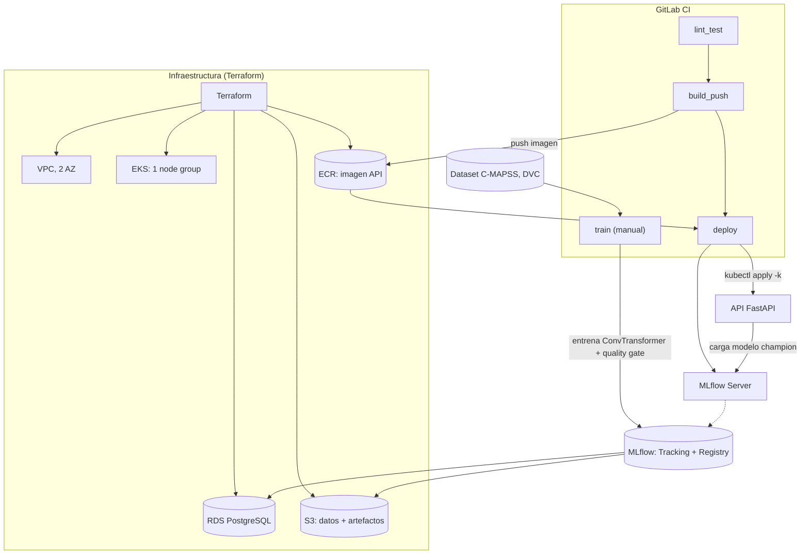

# Predictive Maintenance MLOps

**Plataforma MLOps para clasificación de Vida Útil Remanente (RUL) en motores turbofan**

*Read this in other languages: [English](README.md)*

[](LICENSE)
[](api/pyproject.toml)
[](core_ml/src/train.py)
[](core_ml/src/train.py)
[](kubernetes/base)
[](terraform)
[](.gitlab-ci.yml)

## Qué hace este proyecto

Predice la degradación de motores turbofan usando el dataset C-MAPSS de la NASA. El problema se plantea como una clasificación de 3 clases — **Healthy** (saludable), **Alert** (alerta), **Critical** (crítico) — servida por un **ConvTransformer** (una capa `Conv1d` seguida de un `TransformerEncoder`) entrenado en PyTorch.

Lo interesante no es solo el modelo, sino todo lo que lo rodea para que una predicción sea confiable y reproducible. Los logs crudos de sensores pasan por una preparación de datos versionada y validada contra un esquema; cada corrida de entrenamiento queda atada al código, los datos y la imagen de contenedor exactos que la produjeron; un gate de promoción evita que un modelo que no detecta bien la clase "a punto de fallar" llegue a producción; y todo esto se despliega a un cluster de Kubernetes real mediante infraestructura como código, no a mano.

Cada capa resuelve un problema concreto de este pipeline en particular: DVC fija *qué* dataset produjo un modelo, los contratos de datos con Pandera/Pydantic detectan telemetría malformada antes de desperdiciar una corrida de entrenamiento, el Model Registry de MLflow es la única fuente de verdad sobre "qué modelo está sirviendo ahora mismo", y la capa de FastAPI confía en ese registro en vez de en un `.pkl` que alguien copió a mano.

## Arquitectura



**Flujo, en palabras:**

1. Los datos crudos de C-MAPSS (versionados con DVC) se transforman con `prepare_training_data.py` en ventanas deslizantes de 30 timesteps (`engine_features.parquet` + `scaler.joblib`).
2. `train.py` entrena el ConvTransformer y registra la corrida en MLflow (modelo + scaler + métricas + tags de trazabilidad). Solo pasa al alias `champion` si supera el quality gate.
3. La API FastAPI carga el `champion` y su scaler desde MLflow al arrancar, y sirve `/predict`.
4. GitLab CI: `lint_test` (ruff + pytest) → `build_push` (build + push a ECR) → `deploy` (`kubectl apply -k` directo contra el cluster). `train` es un job manual aparte, porque una corrida completa de entrenamiento puede tardar de minutos a horas y no debería bloquear cada push.

**Algunas decisiones de diseño que vale la pena señalar:**

- **La inferencia es sincrónica, bajo demanda.** Un cliente envía una ventana de lecturas a `/predict` y recibe una clasificación en la misma petición — no hay ningún broker de mensajes ni capa de streaming en el camino, porque nada en este sistema necesita reaccionar a un flujo continuo más rápido de lo que permite un ciclo request/response.
- **Las features se calculan una sola vez, offline.** `prepare_training_data.py` transforma la telemetría cruda en la forma de tensor exacta que consume el modelo, y `train.py` lee ese parquet directamente. Como las predicciones se sirven a partir de una ventana que provee quien llama, y no de valores de feature en vivo constantemente actualizados, no hace falta un store online aparte que mantener sincronizado.
- **El despliegue es un único paso auditable.** El stage `deploy` de CI se autentica contra AWS vía OIDC y corre `kubectl apply -k` contra el overlay ya renderizado. Desde un commit mergeado hasta un pod corriendo hay exactamente un sistema involucrado, lo que hace fácil de trazar el camino cuando algo necesita depurarse.
- **Los secretos son Secrets nativos de Kubernetes.** Las credenciales de RDS, la URI de MLflow y la API key llegan a los pods vía `envFrom: secretRef` (`kubernetes/base/secret.yaml`), lo que mantiene la distribución de credenciales declarativa y definida junto al resto de los manifiestos que describen los workloads.
- **El acceso a S3 viaja sobre el rol IAM del node group.** Todos los pods del cluster heredan la misma política de lectura/escritura acotada para los buckets de DVC y de MLflow, así que hay una sola política que razonar en vez de una por servicio.

## Stack tecnológico

| Categoría | Herramientas |
| --- | --- |
| Machine Learning | PyTorch (CPU-only), ConvTransformer |
| Tracking / Model Registry | MLflow |
| Datos y contratos | DVC (remoto S3), Pandera, Pydantic |
| API de serving | FastAPI, Uvicorn |
| Contenedores / Orquestación | Docker, Docker Compose, Kubernetes (EKS), Kustomize |
| Infraestructura como Código | Terraform (VPC, EKS, RDS, S3, ECR, IAM/OIDC) |
| CI/CD | GitLab CI, autenticación AWS vía OIDC |
| Calidad de código / observabilidad | Ruff, mypy (opcional), pytest, pre-commit, structlog |

## El pipeline de MLOps

**Datos.** Cada etapa valida su propia salida contra un esquema explícito (`core_ml/src/data_contracts.py`, con Pandera) antes de avanzar a la siguiente, más costosa. Un dataset malformado o una lectura `NaN` se rechaza de inmediato. La RUL se deriva por motor como `max(ciclo) - ciclo` y se agrupa en 3 clases: `RUL > 60` → Healthy, `30 < RUL <= 60` → Alert, `RUL <= 30` → Critical.

**El modelo.** `ConvTransformer` (`core_ml/src/train.py`) pasa una capa `Conv1d` sobre la ventana de 30 timesteps para extraer patrones locales de sensores, agrega codificación posicional sinusoidal, y alimenta un `TransformerEncoder` de 2 capas que modela dependencias de largo alcance. Se eligió tras un benchmark de 5 arquitecturas sobre este mismo tipo de tarea C-MAPSS.

**Quality gate.** Un modelo se evalúa contra un split de validación agrupado *por motor* (nunca fila a fila: las ventanas se solapan y un split IID filtraría casi-duplicados entre train y val). La promoción al alias `champion` exige superar **dos** umbrales en `config/config.yaml`: `f2_weighted_threshold` **y** `critical_recall_threshold` (un piso duro sobre el recall de la clase Critical, para que un modelo no compense fallar justo ahí con buen desempeño en las otras clases). Es una comparación directa de métricas contra el champion actual.

**Dataset toy.** `core_ml/data_toy/` (~1000 filas, versionado con DVC) permite correr todo el pipeline en segundos, sin GPU — lo que corre `make smoke-test` y el job `lint_test` de CI antes de tocar el dataset completo.

**Serving.** `api/main.py` carga el modelo `champion` y su `StandardScaler` desde MLflow al arrancar. La forma del input se deduce de la signature del modelo servido, no de una constante hardcodeada, así el contrato de la API sigue automáticamente a cualquier modelo promovido.

## Referencia de la API

| Endpoint | Método | Descripción |
| --- | --- | --- |
| `/health` | `GET` | `200` con `{"status": "ok", "model_version": "<n>", "window_size": <n>, "num_features": <n>}` si hay un modelo `champion` cargado; `503` si no |
| `/predict` | `POST` | Requiere header `X-API-Key`. Body: `{"engine_id": "...", "readings": [[...], ...]}` (una fila por timestep). Devuelve `{"engine_id": "...", "prediction": "Healthy"\|"Alert"\|"Critical", "model_version": "<n>"}` |

`/health` se usa como readiness probe. El liveness probe usa un chequeo TCP simple (no `/health`): un pod sano que todavía no tiene modelo `champion` es un estado de negocio, no un proceso muerto, y no debería reiniciarse en bucle por eso.

## Estructura del repositorio

```text
.
├── api/                    # Microservicio FastAPI (proyecto Poetry propio)
│   ├── main.py               # Carga models:/<name>@champion y sirve /predict
│   └── tests/                 # Tests unitarios (TestClient/mocks)
├── core_ml/                # Datos + entrenamiento (proyecto Poetry propio)
│   ├── src/
│   │   ├── data_contracts.py    # Contratos Pandera (fail fast)
│   │   ├── data_processing.py   # Limpieza + ventanas deslizantes + scaler
│   │   ├── prepare_training_data.py  # Genera engine_features.parquet
│   │   └── train.py             # ConvTransformer + quality gate + MLflow
│   ├── data/ · data_toy/        # Datasets (versionados con DVC, gitignored)
│   └── tests/                    # Tests unitarios
├── config/config.yaml       # Configuración global (validada por Pydantic)
├── kubernetes/
│   ├── base/                # Namespace, ServiceAccount, Secret, ConfigMap,
│   │                          #   Deployments de api/mlflow, HPA
│   └── overlays/production/ # Tag de imagen (kustomize edit set image)
├── terraform/                # VPC, EKS, RDS, S3, ECR, IAM (OIDC de CI)
│   └── bootstrap/              # Una sola vez: backend S3+DynamoDB del estado
├── localstack/init-aws.sh   # Bootstrap de LocalStack (S3 simulado en local)
├── .gitlab-ci.yml           # lint_test → build_push → deploy → train (manual)
├── Makefile                 # Interfaz única de comandos (local + CI)
├── docker-compose.yml       # Stack local: Postgres, MLflow, API, LocalStack
└── Dockerfile                # Imagen de la API
```

## Cómo correrlo en local

### 1. Prerrequisitos

Python 3.12, Poetry 2.4.1, Docker (con Compose v2), `make`, `pre-commit`.

### 2. Instalar dependencias y hooks

```bash
pip install "poetry==2.4.1" pre-commit
make install              # api/ y core_ml/, con dependencias de dev
make precommit-install    # habilita los git hooks
```

### 3. Calidad de código y tests

```bash
make lint       # ruff check
make format     # ruff format (autocorrige)
make typecheck  # mypy (opcional, no bloquea CI)
make test       # pytest en api/ y core_ml/
make ci         # lo mismo que corre el job lint_test de GitLab CI
```

### 4. Validar el pipeline con el dataset toy (segundos, sin GPU)

```bash
make dvc-pull    # descarga data/ y data_toy/ desde el remoto S3 de DVC
make smoke-test  # contratos + entrenamiento + MLflow + quality gate
```

`make smoke-test` es autónomo: si no hay `MLFLOW_TRACKING_URI` exportado, usa un tracking store SQLite efímero.

### 5. Levantar el stack completo con Docker Compose

```bash
make compose-up   # Postgres, MLflow, API, LocalStack
make compose-ps   # healthcheck de cada servicio
```

| Servicio | URL en el host |
| --- | --- |
| API | `http://localhost:8001` (`/health`, `/predict`, `/docs`) |
| MLflow UI | `http://localhost:5001` |
| LocalStack | `http://localhost:4567` |
| Postgres | `localhost:5433` |

`/health` devuelve `503` hasta que un modelo tenga el alias `champion` en este MLflow local — es el estado inicial esperado:

```bash
export MLFLOW_TRACKING_URI=http://localhost:5001
make train-toy
docker compose restart api
```

Los puertos del host están corridos (8001, 5001, 4567, 5433 en vez de los defaults) para que este stack pueda convivir con otros proyectos en la misma máquina sin pisarse; los puertos internos de los contenedores no cambian.

## Cómo entrenar el modelo

```bash
make dvc-pull      # trae core_ml/data/ completo
make train         # prepara features + entrena (25 epochs, patience 5) + quality gate
```

Por debajo, `make train` encadena las dos etapas del pipeline:

1. **`prepare_training_data.py`** lee los `.txt` crudos de C-MAPSS, los limpia y los transforma en ventanas (`data_processing.py`), y escribe `engine_features.parquet` + `scaler.joblib` en el mismo directorio de datos versionado con DVC.
2. **`train.py`** carga ese parquet, lo valida contra su contrato de datos, entrena el `ConvTransformer` con un split train/val agrupado por motor, y registra la corrida en MLflow — modelo, scaler, métricas, y una tupla de trazabilidad con `commit de git + hash de datos de DVC + hiperparámetros + ID de run de MLflow + tag de imagen de contenedor`. Solo promueve la corrida al alias `champion` si supera el quality gate.

`train.py` es reproducible (`torch.manual_seed(42)`, split train/val seedeado y agrupado por motor): dado un run de MLflow, siempre se puede reconstruir con qué commit, qué versión de datos y qué imagen se generó, vía las tags de trazabilidad del run. En GitLab CI, el job `train` es manual (no corre en cada push) porque entrenar contra el dataset completo puede tardar minutos u horas.

## Cómo servir predicciones

Una vez que un modelo fue promovido a `champion`, `api/main.py` lo carga junto con su scaler desde el Model Registry de MLflow al arrancar y expone `/predict`. Una petición se ve así:

```bash
curl -X POST http://localhost:8001/predict \
  -H "Content-Type: application/json" \
  -H "X-API-Key: local-dev-only-key-change-me" \
  -d '{"engine_id": "FD001_23", "readings": [[...30 filas de valores de sensores...]]}'
```

La respuesta trae la clase predicha (`Healthy` | `Alert` | `Critical`) y la versión del modelo que la produjo, de modo que quien llama siempre puede saber qué modelo registrado respondió una petición dada. Las peticiones con una forma de ventana incorrecta, valores de sensor no finitos, o un `engine_id` ausente/vacío se rechazan con `422` antes de llegar al modelo (`api/schemas.py`); las peticiones sin un `X-API-Key` válido se rechazan con `401`.

## Cómo desplegar en AWS

Esto asume una cuenta de AWS propia y cuesta dinero real (EKS + RDS + NAT Gateway, aunque sea con instancias chicas). Pasos, en orden:

```bash
# 1. Una sola vez: backend remoto del estado de Terraform
cd terraform/bootstrap && terraform init && terraform apply
# copiar el output "backend_config" al backend "s3" de terraform/provider.tf

# 2. Aprovisionar la infraestructura y apuntar kubectl al cluster nuevo
cd terraform && terraform init -migrate-state && terraform apply
aws eks update-kubeconfig --name predictive-maintenance-mlops --region us-east-1

# 3. Completar el Secret de Kubernetes con las credenciales reales
#    (terraform output -raw db_password / db_username; ver kubernetes/base/secret.yaml)
kubectl create secret generic mlops-secrets -n mlops-env \
  --from-literal=POSTGRES_USER=<...> --from-literal=POSTGRES_PASSWORD=<...> \
  --from-literal=POSTGRES_DB=mlflow_db --from-literal=API_KEY="$(openssl rand -hex 32)" \
  --dry-run=client -o yaml | kubectl apply -f -

# 4. Build + push de la imagen de la API, y despliegue
make docker-build docker-push deploy IMAGE_TAG=$(git rev-parse --short HEAD)
```

En GitLab CI, esto lo hacen automáticamente los stages `build_push` y `deploy` en cada push (autenticándose contra AWS vía OIDC, sin credenciales estáticas — ver `terraform/iam.tf`). `make k8s-build` renderiza el overlay para inspección antes de aplicar; `make k8s-diff` muestra el diff contra el cluster actual.

Terraform provisiona una VPC en 2 zonas de disponibilidad, un cluster EKS de un node group, una instancia RDS PostgreSQL (el backend store de MLflow), un bucket S3 (datos de DVC + artefactos de MLflow), un repositorio ECR para la imagen de la API, y los roles IAM / proveedores OIDC que CI necesita para autenticarse sin credenciales de larga duración.

## Testing y calidad

| Aspecto | Herramienta | Comando |
| --- | --- | --- |
| Lint | [Ruff](https://docs.astral.sh/ruff/) | `make lint` |
| Formato | Ruff format | `make format-check` |
| Tipado estático (opcional) | [mypy](https://mypy-lang.org/) | `make typecheck` |
| Tests unitarios | [pytest](https://docs.pytest.org/) | `make test` |
| Higiene de archivos/YAML | pre-commit hooks | `make precommit-run` |

`make ci` corre lo mismo que el job `lint_test` de `.gitlab-ci.yml`: si pasa en local, el pipeline de CI también debería pasar. Tanto `api/` como `core_ml/` son proyectos Poetry independientes, cada uno con su propio `pyproject.toml`, lockfile y suite de tests, y pre-commit corre los mismos comandos de ruff/mypy/pytest contra el proyecto cuyos archivos cambiaron en un commit.

## Licencia

Distribuido bajo la Licencia MIT. Ver [`LICENSE`](LICENSE) para el texto completo.

**Autor:** Armando Guarnera — [github.com/arguar13](https://github.com/arguar13)
